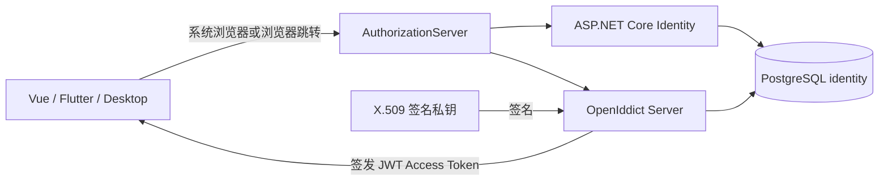
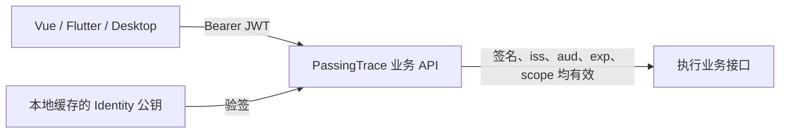

# PassingTrace Identity 后端技术实现说明

> 版本：v1.0
> 对应实现：.NET 10 / OpenIddict 7.6 / PostgreSQL
> 文档范围：当前仓库中的身份服务、数据库、协议端点、Aspire 编排与集成测试。

## 1. 服务定位

PassingTrace Identity 是 PassingTrace 各客户端和业务服务共同信任的身份提供方（Identity Provider）。它当前负责：

- 创建唯一用户名账号并安全保存密码哈希；
- 在 Identity 域维护浏览器登录 Cookie，从而实现同一浏览器中的单点登录；
- 实现 OAuth 2.0 / OpenID Connect 的 Authorization Code + PKCE；
- 签发短期 JWT Access Token、ID Token 和长期 Refresh Token；
- 通过 Discovery 与 JWKS 公布协议元数据和 JWT 验签公钥；
- 让业务服务只依赖标准协议验证用户，不引用 Identity 内部程序集。

当前明确不包含邮箱、邮件验证码、第三方登录、MFA、动态客户端注册、角色和业务权限管理。

这里存在两种不同的“登录状态”：

| 状态 | 保存位置 | 用途 |
|---|---|---|
| Identity Cookie | Identity 域的 HttpOnly Cookie | 证明用户已经在 Identity 网站输入过正确密码，实现浏览器 SSO |
| OAuth Token | 各客户端自己的安全存储 | Access Token 调用业务 API；Refresh Token 在 Access Token 到期后续签 |

业务 API 不读取 Identity Cookie，客户端也不能拿 Cookie 当 API Token 使用。

## 2. 总体架构

登录、授权和 Token 签发属于 Identity 的状态链路，这条链路会访问数据库：



客户端携带 Access Token 调用业务 API 时走另一条链路。业务 API 使用已经缓存的公钥在本地验签，请求路径不经过 AuthorizationServer，也不查询 Identity 数据库：



业务 API 只会在首次启动、缓存缺失或签名密钥轮换时，通过 Discovery/JWKS 从 AuthorizationServer 获取公钥并缓存。JWKS 由 AuthorizationServer 的 X.509 签名证书生成，不从 `OpenIddictTokens` 表读取。这个公钥获取过程不属于每次业务请求的验签路径。

一次完整登录的职责分工：

1. 客户端生成 PKCE verifier/challenge，并打开 `/connect/authorize`。
2. OpenIddict 校验客户端、回调地址、response type、Scope 和 PKCE 参数。
3. AuthorizationServer 检查 Identity Cookie；没有 Cookie 就跳转 `/account/login`。
4. ASP.NET Core Identity 验证用户名、密码、账号状态和锁定状态，成功后写入 Cookie。
5. AuthorizationServer 建立包含 `sub`、用户名、Scope 和 Resource 的授权主体。
6. OpenIddict 生成一次性 Authorization Code 并返回客户端回调地址。
7. 客户端把 Code 与原始 verifier 提交到 `/connect/token`。
8. OpenIddict 校验 Code、PKCE、客户端和有效期，然后签发 Token。
9. 客户端使用 Access Token 调用业务 API；API 通过 Identity 的 JWKS 验证签名。

## 3. 解决方案模块

### 3.1 AppHost

目录：`AppHost/`

本地开发编排入口，使用 .NET Aspire 统一管理：

- PostgreSQL 容器和持久化数据卷；
- `identity` 数据库及连接字符串注入；
- Identity AuthorizationServer 的启动依赖；
- Vue Vite 前端、固定端口 5173 和 Identity 地址注入；
- Aspire Dashboard、资源状态和 OpenTelemetry 接收端点。

AppHost 不包含认证业务逻辑。删除 Vue 的 `AddViteApp` 只会取消统一启动，不会改变 Vue 或 Identity 本身。

### 3.2 PassingTrace.Identity.Domain

目录：`Identity/PassingTrace.Identity.Domain/`

领域模型层，不负责数据库和 HTTP：

- `User`：继承 `IdentityUser<long>`，复用成熟的用户名、密码哈希、安全戳、并发戳和锁定字段；
- `UserStatus`：额外表达 PassingTrace 业务上的 Active/Disabled 状态；
- `CreatedAt`、`UpdatedAt`、`LastLoginAt`：保存账号审计时间。

`Disabled` 与 Identity 自带的临时锁定不同：锁定通常由连续密码失败触发并自动到期；Disabled 是业务停用状态，登录、授权和刷新都会拒绝。

### 3.3 PassingTrace.Identity.Application

目录：`Identity/PassingTrace.Identity.Application/`

当前保持最小应用层，只拥有不依赖 ASP.NET、EF Core 的账号规则：

- `UsernamePolicy`：用户名必须匹配 `^[A-Za-z0-9_-]{3,32}$`；
- 规则同时供注册页面和 Infrastructure 中的 Identity 验证器使用。

该项目不能引用 `IdentityDbContext`，从而保证规则不会被数据库实现绑死。

### 3.4 PassingTrace.Identity.Infrastructure

目录：`Identity/PassingTrace.Identity.Infrastructure/`

基础设施层负责把领域对象接到框架和数据库：

- `IdentityDbContext`：ASP.NET Core Identity 与 OpenIddict 的统一 EF Core DbContext；
- `ServiceCollectionExtensions`：注册 PostgreSQL、Identity、密码策略、锁定策略和 Cookie；
- `IdentityUsernameValidator`：把应用层用户名规则接入所有 `UserManager` 写入口；
- `UserConfiguration`：定义 PostgreSQL 表名、列名、长度和唯一索引；
- `Persistence/Migrations`：正式数据库迁移。

### 3.5 PassingTrace.Identity.AuthorizationServer

目录：`Identity/PassingTrace.Identity.AuthorizationServer/`

唯一可执行的 Identity Web Host，也是 OAuth 2.0/OIDC 协议服务器：

- `Program.cs`：组合 Identity、OpenIddict、EF Core、CORS、OpenTelemetry 和中间件；
- `AuthorizationController`：处理 authorize、token 和 logout 的业务决策；
- `Pages/Account`：Identity 托管的注册和登录 Razor Pages；
- `Setup/OpenIddictSeeder`：幂等同步 Scope 与第一方客户端；
- `appsettings.json`：声明客户端、回调地址和 Web CORS 来源；
- `Views/Authorization/Logout.cshtml`：退出确认页。

之所以仍使用 Razor Pages 托管用户名密码页面，是为了让 Vue、Flutter 和桌面客户端都不直接收集密码。客户端只处理标准授权码和 Token。

### 3.6 PassingTrace.Identity.IntegrationTests

目录：`tests/PassingTrace.Identity.IntegrationTests/`

使用 `WebApplicationFactory<Program>` 启动真实 ASP.NET Core 管道，并把 PostgreSQL替换为内存 SQLite。当前覆盖：

- 完整 Authorization Code + PKCE、JWT、Refresh Token 和 SSO；
- 错误 PKCE verifier 无法换 Token；
- 用户名规则和忽略大小写的唯一性；
- 五次密码失败后的账号锁定。

测试环境使用临时签名/加密密钥，不依赖开发机证书。

## 4. 引入的技术与用途

| 技术 | 当前版本 | 作用 |
|---|---:|---|
| .NET / ASP.NET Core | 10.0 | Web Host、Razor Pages、Controller、Cookie、中间件和依赖注入 |
| ASP.NET Core Identity | 10.0.11 | 用户、密码哈希、安全戳、锁定、Cookie 登录和 UserManager/SignInManager |
| OpenIddict | 7.6.0 | OAuth 2.0 / OIDC Server、Authorization Code、PKCE、Token、Discovery、JWKS |
| Entity Framework Core | 10.0.11 | 用户和协议数据的对象关系映射与 Migration |
| Npgsql EF Provider | 10.0.3 | PostgreSQL 数据库驱动与 EF Core Provider |
| PostgreSQL | Aspire 容器资源 | 持久化用户、客户端、授权、Scope 和 Token |
| .NET Aspire | 13.4.6 | 本地编排、数据库连接注入、资源依赖、Dashboard 与前端联动 |
| OpenTelemetry | 1.17.0 | ASP.NET Core、HttpClient、Npgsql Trace 采集和 OTLP 导出 |
| xUnit + WebApplicationFactory | .NET 测试项目 | 端到端验证真实身份协议流程 |

## 5. 用户与密码实现

### 5.1 用户名

- 长度 3–32；
- 只允许 ASCII 字母、数字、`_`、`-`；
- Identity 保存 `NormalizedUserName`；
- PostgreSQL 对 `normalized_username` 建唯一索引；
- 因此 `Alice` 与 `alice` 被视为同一个用户名；
- 数据库唯一索引同时解决两个并发注册请求的竞争问题。

### 5.2 密码

- 注册页面要求 12–128 位；
- 不强制大小写、数字或特殊字符组合，鼓励使用长口令；
- 明文密码只在一次 HTTPS 请求内交给 `UserManager.CreateAsync`；
- 数据库只保存 ASP.NET Core Identity 生成的 `PasswordHash`；
- 项目不实现自定义哈希、解密或密码比对逻辑。

### 5.3 失败锁定

`PasswordSignInAsync(..., lockoutOnFailure: true)` 会增加 `AccessFailedCount`。连续失败 5 次后，Identity 设置 `LockoutEnd`，账号锁定 15 分钟。用户名不存在、密码错误、账号停用和锁定都返回同一条提示，降低用户名枚举风险。

## 6. 手机注册、移动登录与扫码页面

### 6.1 手机注册 `/api/mobile/registrations`

1. Flutter 先创建绑定用户名、Client ID、Redirect URI 与 PKCE 的两分钟注册意图；
2. 完成注册时验证首次安装引导码；
3. `UserManager` 创建用户并生成密码哈希；
4. 服务端保存随机设备密钥的 SHA-256 哈希，明文只返回手机一次；
5. Flutter 在系统浏览器消费一次性交接码，再继续标准 OIDC。

注册接口不会直接返回 JWT。JWT 只能由标准 `/connect/token` 端点在验证授权码和 PKCE 后签发。

### 6.2 移动登录 `/account/login`

1. Flutter 必须先用设备 ID 与设备密钥创建移动启动票据；直接访问页面返回 404；
2. 按标准化用户名查询用户；
3. 先检查业务状态 Active；
4. `PasswordSignInAsync` 验证密码、锁定状态并创建 Cookie；
5. 消费一次性启动票据并返回原始 `/connect/authorize` 请求。

Web/桌面客户端无 Cookie 时进入 `/account/qr-login/{id}`。QRCoder 生成两分钟 SVG，手机使用带批准 Scope 的 JWT 查询并批准，原浏览器凭 HttpOnly 绑定 Cookie和防伪 Token完成登录。

Cookie 配置：

- 名称：`PassingTrace.Identity`；
- HttpOnly：启用，JavaScript 无法读取；
- SameSite：Lax，允许顶层 OIDC 跳转；
- 生产环境 Secure：强制；
- 有效期：8 小时；
- SlidingExpiration：启用。

## 7. OpenID Connect / OAuth 2.0 实现

### 7.1 端点

| 端点 | 方法 | 用途 |
|---|---|---|
| `/.well-known/openid-configuration` | GET | Discovery 元数据 |
| Discovery 中的 `jwks_uri` | GET | 发布 JWT 验签公钥 |
| `/connect/authorize` | GET/POST | 校验浏览器会话并签发 Authorization Code |
| `/connect/token` | POST | 使用 Code 或 Refresh Token 换 Token |
| `/connect/logout` | GET/POST | 确认退出、清除 Cookie、完成 OIDC 退出 |

仅启用：

- Authorization Code；
- Refresh Token；
- PKCE S256。

未启用 Password Grant、Implicit、Client Credentials，也删除了不安全的 PKCE `plain` 方法。

### 7.2 Authorize

`AuthorizationController.Authorize` 接收 OpenIddict 已验证过的协议请求：

- 移动端没有 Cookie 时仅在启动票据有效时跳转密码页；Web/桌面端进入扫码页；
- `prompt=none` 且未登录时返回标准 `login_required`；
- Cookie 对应用户不存在、Disabled 或不可登录时清除旧 Cookie；
- 第一方客户端使用 implicit consent，不显示授权同意页；
- 按用户、客户端和 Scope 复用或创建永久 Authorization；
- Scope `passingtrace.api` 被映射到 Resource `passingtrace-api`，最终进入 JWT 的 `aud`。

### 7.3 Token Exchange

`AuthorizationController.Exchange` 只接受 Code 和 Refresh Token：

- 授权码、PKCE、客户端、重放和有效期由 OpenIddict 验证；
- 服务再次读取当前用户，Disabled 用户不能换取或刷新 Token；
- 从已验证主体复制 Claim，再刷新用户名等当前值；
- 返回 `SignIn` 后由 OpenIddict 生成协议响应。

### 7.4 Token 设计

| Token | 生命周期 | 说明 |
|---|---:|---|
| Access Token | 15 分钟 | 非对称签名、不加密的 JWT，供业务服务离线验签 |
| Refresh Token | 30 天 | 由 OpenIddict 安全保护并在数据库跟踪 |
| Authorization Code | 短期、一次性 | 必须同时提交正确的 PKCE verifier |
| ID Token | 按 OIDC 流程签发 | 表达客户端登录身份，不用于调用业务 API |

Access Token 的关键 Claim：

- `sub`：用户的 long ID 字符串；
- `preferred_username` / `name`：当前用户名；
- `client_id`：获得 Token 的客户端；
- `scope`：获得的权限范围；
- `iss`：Identity issuer；
- `aud`：`passingtrace-api`；
- `iat`、`exp`、`jti`：签发时间、过期时间、Token ID。

`SecurityStamp` 不会写入 Token。Claim 只有经过 `SetDestinations` 明确指定后才会进入 Access Token 或 ID Token。

## 8. 客户端注册与 SSO

`appsettings.json` 当前声明四个无 Client Secret 的公共客户端：

| Client ID | 类型 | Redirect URI |
|---|---|---|
| `passingtrace-mobile` | Flutter App | `com.passingtrace.mobile:/oauth2redirect` |
| `passingtrace-desktop` | 桌面端 | `com.passingtrace.desktop:/oauth2redirect` |
| `passingtrace-web` | Vue SPA | 登录：`http://localhost:5173/auth/callback`；退出：`http://localhost:5173/auth/logout-callback` |
| `passingtrace-sso-demo` | 独立 SSO 验证站 | 登录：`http://localhost:5174/auth/callback`；退出：`http://localhost:5174/auth/logout-callback` |

`OpenIddictSeeder` 在启动时幂等创建或更新这些客户端和 `passingtrace.api` Scope。客户端配置改变后重启服务即可同步，不需要手工修改协议表。

SSO 的含义是：同一个浏览器已经拥有 Identity Cookie 时，另一个第一方客户端再次打开 `/connect/authorize`，可以直接取得新授权码，不必重复输入密码。每个客户端仍拥有各自的 Access/Refresh Token，不能互相读取。

仓库中的 `passingtrace-sso-demo` 是可视化证明：它运行在不同 Origin、使用不同 Client ID 和独立 `sessionStorage`。先在 5173 主站登录，再从 5174 发起授权；如果直接回到验证站并显示同一 `sub`，说明复用的是 Identity Cookie，而不是复制主站 Token。

Vue 使用 `sessionStorage` 保存自己的 Token；Flutter/桌面端应使用操作系统安全存储。服务端永远不相信“客户端说自己已登录”，只验证 Cookie 或签名 Token。

## 9. 数据库

数据库连接名固定为 `identity`。主要表：

| 表 | 所属技术 | 用途 |
|---|---|---|
| `identity_user` | Identity | 用户、密码哈希、安全戳、锁定和业务状态 |
| `identity_role` 等 | Identity | 预留角色、Claim、外部登录和 Token 结构，V1 暂未使用角色 |
| `OpenIddictApplications` | OpenIddict | OAuth 客户端及允许的回调/权限 |
| `OpenIddictScopes` | OpenIddict | Scope 与 Resource 映射 |
| `OpenIddictAuthorizations` | OpenIddict | 用户授予客户端的永久授权 |
| `OpenIddictTokens` | OpenIddict | Authorization Code、Refresh Token 以及已签发 Token 的状态/元数据记录 |
| `identity_mobile_device` | PassingTrace | 手机设备 ID 与设备密钥哈希 |
| `identity_mobile_authorization_ticket` | PassingTrace | 注册意图、交接码和移动启动票据 |
| `identity_qr_login_transaction` | PassingTrace | 二维码、浏览器绑定、授权恢复信息与状态机 |

OpenIddict 默认启用 Token 存储，所以“签发 JWT”与“写入一条 Token 记录”可以同时发生。这不表示 JWT 必须依赖数据库才能验证：Access Token 自身携带 Claims 和签名，业务 API 使用公钥即可离线验证。数据库记录主要服务于 Authorization Code 一次性消费、Refresh Token 续签和撤销、授权关系管理等 Identity 端操作；当前业务 API 的 `JwtBearer` 校验不会读取这张表。

因此需要区分：

| 场景 | 是否访问 Identity 数据库 |
|---|---|
| 用户名密码登录、账号锁定检查 | 是 |
| 创建授权、签发 Authorization Code | 是 |
| 使用 Authorization Code/Refresh Token 换取 Token | 是 |
| AuthorizationServer 记录已签发 Token 的状态/元数据 | 是 |
| 业务 API 校验 JWT Access Token | 否，使用本地缓存的公钥 |
| 业务 API 处理具体业务数据 | 只访问自己的业务数据库，不访问 Identity 数据库 |

开发环境启动时自动执行 `Database.MigrateAsync()`；生产环境禁止自动迁移，应在部署阶段执行：

```powershell
dotnet ef database update `
  --project Identity/PassingTrace.Identity.Infrastructure `
  --startup-project Identity/PassingTrace.Identity.AuthorizationServer
```

Initial Migration 与 `MobileRegistrationAndQrLogin` Migration 位于 `Infrastructure/Persistence/Migrations`。

## 10. 签名证书与环境

| 环境 | 密钥策略 |
|---|---|
| Testing | 临时加密密钥和签名密钥，进程结束即消失 |
| Development | OpenIddict Development Signing/Encryption Certificate |
| 非开发环境 | 必须配置持久化 X.509 签名和加密证书，否则启动失败 |

生产配置示意：

```json
{
  "OpenIddict": {
    "Issuer": "https://identity.example.com/",
    "Certificates": {
      "Signing": { "Path": "...", "Password": "由密钥系统注入" },
      "Encryption": { "Path": "...", "Password": "由密钥系统注入" }
    }
  }
}
```

证书密码不应提交到仓库。签名证书必须跨实例和部署持久化，否则已签发 JWT 会突然无法验签。

## 11. CORS、HTTPS 与安全边界

- 所有生产授权和 Token 请求必须使用 HTTPS；
- CORS 只允许配置中的 Web Origin，不使用 `AllowAnyOrigin`；
- Flutter/桌面通过系统浏览器和自定义 URI 回调，不依赖浏览器 CORS；
- Redirect URI 必须精确匹配注册值，防止授权码被发送到攻击者地址；
- PKCE 防止截获授权码的人在没有 verifier 时兑换 Token；
- Access Token 只有 15 分钟，退出后已签发 JWT 最长仍可能有效到过期；
- 当前退出只清除浏览器 Cookie 并完成客户端退出，没有服务端批量撤销该用户的 Refresh Token；
- 每次 Refresh 都重新检查 UserStatus，停用用户不能继续延长会话；
- 登录错误统一，降低账号枚举；
- `returnUrl` 只接受本地 URL，避免登录/注册页成为开放重定向器；
- 退出 POST 使用 Anti-forgery Token，避免跨站强制退出。

## 12. OpenTelemetry

当前采集三类 Trace：

- ASP.NET Core 入站请求；
- HttpClient 出站请求；
- Npgsql 数据库操作。

当存在 `OTEL_EXPORTER_OTLP_ENDPOINT` 时启用 OTLP 导出。通过 AppHost 启动时，Aspire 会提供本地可观测性接收端点；代码没有把具体观测平台写死。

不要在 Trace/日志中记录密码、Authorization Code、Access Token、Refresh Token 或完整 Cookie。

## 13. 业务服务如何信任 Identity

业务服务只通过协议建立信任，不引用 Domain/Application/Infrastructure：

```csharp
services.AddAuthentication(JwtBearerDefaults.AuthenticationScheme)
    .AddJwtBearer(options =>
    {
        options.Authority = configuration["Identity:Authority"];
        options.Audience = "passingtrace-api";
        options.MapInboundClaims = false;
        options.RequireHttpsMetadata = true;
    });
```

并在管道中启用：

```csharp
app.UseAuthentication();
app.UseAuthorization();
```

- 无 Token、过期、签名错误、issuer/audience 错误：401；
- Token 有效但缺少 `passingtrace.api` Scope：403；
- 业务用户键取自 `sub`，不能信任客户端额外提交的 `user_id`。

更完整的接入示例见 `PassingTrace.Identity_单点登录接入说明_v1.0.md`。

## 14. 本地启动与验证

推荐在 Visual Studio 中把 AppHost 设置为启动项目，或执行：

```powershell
dotnet run --project AppHost/AppHost.csproj
```

它会一起启动 PostgreSQL、Identity 和 Vue。只调试 Identity 时可单独启动 `PassingTrace.Identity.AuthorizationServer`，但需要自己提供 `ConnectionStrings:identity`。

验证命令：

```powershell
dotnet build PassingTrace.slnx
dotnet test PassingTrace.slnx

corepack pnpm --dir passingtrace-web type-check
corepack pnpm --dir passingtrace-web test:unit
corepack pnpm --dir passingtrace-web build
```

## 15. 当前限制与后续方向

1. 退出不能立即使已签发 JWT 失效，当前窗口最多 15 分钟；高风险操作可增加重新认证或 Token introspection。
2. 当前退出没有服务端撤销 Refresh Token family；正常客户端会删除本地 Token，但被复制的 Refresh Token 仍可能使用到过期。后续应按授权或会话维护撤销能力。
3. 目前没有邮箱和凭据恢复，忘记密码需要后续设计可靠的恢复通道。
4. 角色表虽然存在，但 Token 不包含角色，业务权限应在需求明确后再设计。
5. 第一方客户端来自静态配置，不支持第三方动态注册和 consent UI。
6. 开发环境自动迁移仅适合本地；生产需要独立迁移、证书轮换和备份流程。
7. 多实例部署需要共享 Data Protection/证书策略，并验证 Refresh Token 并发与轮换策略。
8. 应继续增加登出回调、错误 issuer/audience、Refresh Token 重放和生产配置失败测试。

## 16. 关键代码索引

| 关注点 | 文件 |
|---|---|
| 服务组合与 OpenIddict 配置 | `AuthorizationServer/Program.cs` |
| 授权码、Token、退出 | `AuthorizationServer/Controllers/AuthorizationController.cs` |
| 登录与锁定 | `AuthorizationServer/Pages/Account/Login.cshtml.cs` |
| 注册与并发重名 | `AuthorizationServer/Pages/Account/Register.cshtml.cs` |
| 客户端/Scope 初始化 | `AuthorizationServer/Setup/OpenIddictSeeder.cs` |
| Identity、密码、Cookie 配置 | `Infrastructure/DependencyInjection/ServiceCollectionExtensions.cs` |
| 数据库上下文 | `Infrastructure/IdentityDbContext.cs` |
| User 映射与唯一索引 | `Infrastructure/Persistence/Configurations/UserConfiguration.cs` |
| 用户名规则 | `Application/Accounts/UsernamePolicy.cs` |
| 用户领域模型 | `Domain/Entities/User.cs` |
| Aspire 编排 | `AppHost/AppHost.cs` |
| 端到端测试 | `tests/PassingTrace.Identity.IntegrationTests/IdentityFlowTests.cs` |
