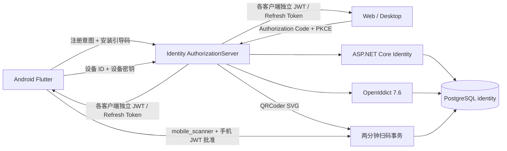
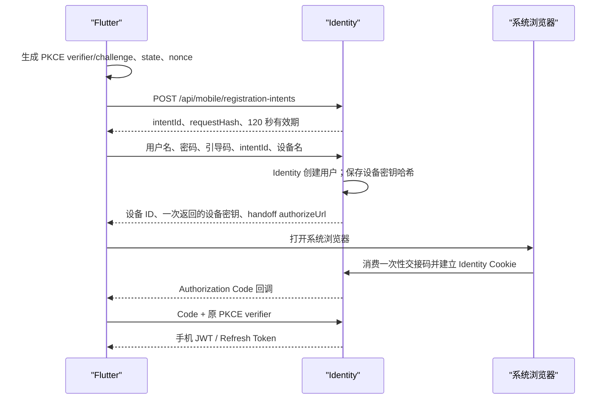
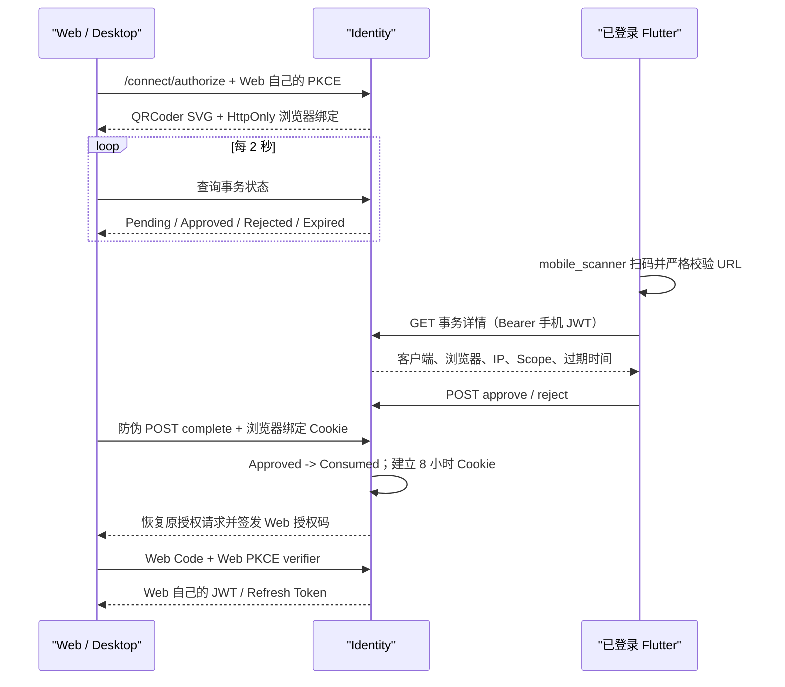
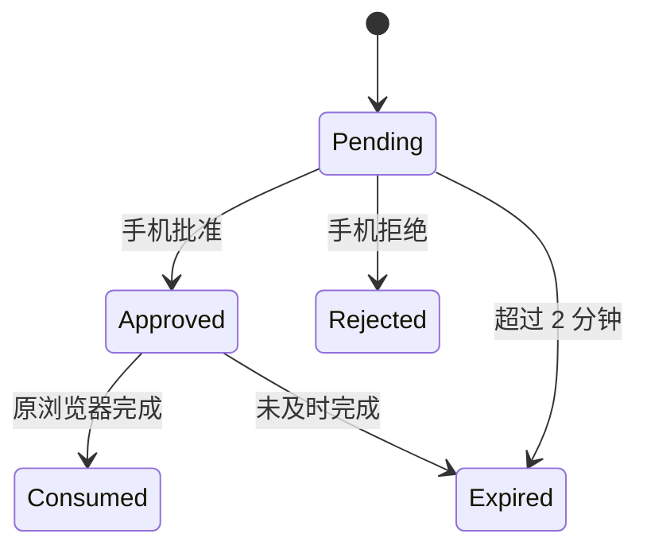

# PassingTrace Identity 手机端注册与扫码登录技术方案

> 版本：v0.1
> 状态：核心功能已实现，待真机联调
> 更新日期：2026-08-17
> 适用范围：PassingTrace Identity、Android Flutter 客户端、Web 与桌面客户端

## 1. 目标与边界

PassingTrace 当前按个人自用软件设计，不发布到应用商店：

- Android Flutter 是唯一注册入口；
- Web/桌面端不显示注册页，也不能直接使用用户名密码登录；
- 手机首次注册使用仅实例所有者知道的安装引导码；
- 注册后服务器签发随机设备密钥，Flutter 使用系统安全存储保存；
- 已登记手机可以通过系统浏览器登录，并扫描、批准 Web/桌面登录；
- 手机和每个 Web/桌面客户端分别执行 Authorization Code + PKCE，分别获得自己的 Token；
- 业务 API 使用 Identity 的 Discovery/JWKS 公钥验证 JWT，不查询 Identity 数据库。

当前不实现邮箱、短信、MFA、第三方登录、忘记密码、账号迁移、顶号、应用商店证明和 iOS。

## 2. 总体架构



| 组件 | 职责 |
|---|---|
| Flutter | 原生注册、设备凭据、系统浏览器 OIDC、安全 Token 存储、扫码与批准 |
| AuthorizationServer | 移动票据、二维码事务、Cookie、OIDC 编排、限流和审计边界 |
| ASP.NET Core Identity | 唯一用户名、密码哈希、锁定、用户状态、8 小时浏览器 Cookie |
| OpenIddict | 客户端、Scope、授权码、PKCE、JWT、Refresh Token、Discovery/JWKS |
| QRCoder 1.8.0 | 服务端在内存中生成 SVG 二维码 |
| mobile_scanner 7.4.0 | Android 使用 CameraX/ML Kit 扫描二维码 |
| flutter_secure_storage | 保存设备密钥、Access Token 和 Refresh Token |

## 3. 个人侧载的注册安全模型

不接 Google Play 后，不能依赖 Play Integrity 判断“官方安装包”。当前采用更适合个人实例的两层控制：

1. `MobileRegistration:BootstrapCode` 是首次安装引导码；注册请求不知道该值便不能创建账号。
2. 注册成功生成 256 位随机 `deviceSecret`；数据库只保存 SHA-256 哈希，明文只返回一次并写入手机安全存储。

默认 `MaxUsers=1`，首个账号创建后关闭继续注册。开发环境示例引导码为 `passingtrace-local-setup`，只用于本机联调；长期使用时应改为环境变量或 .NET User Secrets 中的高熵随机值，不能提交真实值。

这种方案的边界是：拿到 APK 的人仍无法注册，但拿到引导码的人可以在注册窗口创建账号。它适合单人、自托管和侧载，不等价于应用商店硬件/应用证明。

## 4. 手机注册与登录

### 4.1 首次注册



注册接口不直接返回 JWT。交接码绑定移动 Client ID、Redirect URI、PKCE challenge、新用户和两分钟过期时间，并且只能成功消费一次。

### 4.2 后续登录

1. Flutter 从安全存储读取 `deviceId/deviceSecret`。
2. Flutter 创建新的 PKCE，并调用 `/api/mobile/authorization-launches`。
3. Identity 验证设备密钥哈希后返回两分钟一次性 `launch_ticket` URL。
4. Flutter 在系统浏览器打开该 URL；用户在 Identity 托管页输入用户名和密码。
5. Flutter 收到自定义 Scheme 回调，用 PKCE verifier 换取 Token。

直接访问 `/account/login` 没有移动启动票据时返回 404；`/account/register` 不存在。密码仍只提交给 Identity 托管页，不提交给普通 Web/桌面客户端。

## 5. 二维码从哪里产生

Web/桌面调用 `/connect/authorize` 且浏览器没有 Identity Cookie 时，AuthorizationServer：

1. 用 `RandomNumberGenerator` 生成 32 字节一次性 code；
2. 数据库只保存 `SHA-256(code)`；
3. 保存浏览器绑定哈希、受 Data Protection 保护的原授权请求、Client ID 和两分钟有效期；
4. 拼出二维码内容：

```text
https://identity.example.com/mobile/qr-login?v=1&code={base64url_code}
```

5. 使用 QRCoder 直接生成 SVG 并嵌入 Razor 页面，不调用任何二维码云服务；
6. 页面每两秒轮询事务状态。

二维码中没有 JWT、Refresh Token、授权码、用户 ID、用户名、密码或浏览器 Cookie。

开发模拟器使用：

```json
{
  "QrLogin": {
    "PublicOrigin": "http://10.0.2.2:56229"
  }
}
```

`10.0.2.2` 是 Android Emulator 到宿主 Windows 的特殊地址。真机侧载时要改成电脑局域网地址，并让后端监听该地址；正式长期使用应配置可由手机访问的 HTTPS 域名。

## 6. Web/桌面扫码登录



手机批准只表示“允许这个浏览器继续登录”。手机 Token 不会复制给 Web。另一个浏览器即使拍到同一二维码，也没有原浏览器的 HttpOnly 绑定秘密与防伪 Token，不能消费登录结果。

## 7. Flutter 二维码校验

Flutter 在联网前检查：

- 生产只接受 HTTPS；Debug 仅额外接受 `localhost`/`10.0.2.2` 的 HTTP；
- Host 和 Port 必须与当前配置的 Identity 完全一致；
- Path 必须为 `/mobile/qr-login`；
- `v` 必须为 `1`；
- 只能有 `v` 与 `code` 两个查询参数，且不能有 Fragment；
- code 必须是 32 字节对应的 43 位 Base64Url 字符串。

通过校验后，用带 `passingtrace.identity.login-approve` Scope 的手机 Access Token读取事务详情。用户看到客户端名称、浏览器、IP 和过期时间后才能批准。

## 8. 接口

| 方法与路径 | 身份要求 | 用途 |
|---|---|---|
| `POST /api/mobile/registration-intents` | 引导码在下一步验证 | 创建绑定用户名和 PKCE 的注册意图 |
| `POST /api/mobile/registrations` | 安装引导码 | 创建 Identity 用户、设备和交接票据 |
| `POST /api/mobile/authorization-launches` | 设备 ID + 设备密钥 | 创建移动登录启动票据 |
| `GET /api/qr-login/transactions/{code}` | 手机 JWT + 批准 Scope | 查看扫码事务证据 |
| `POST .../{code}/approve` | 手机 JWT + 批准 Scope | 批准网页登录 |
| `POST .../{code}/reject` | 手机 JWT + 批准 Scope | 拒绝网页登录 |
| `GET /account/qr-login/{id}/status` | 浏览器绑定 Cookie | 轮询事务状态 |
| `POST /account/qr-login/{id}/complete` | 浏览器绑定 + 防伪 Token | 消费批准并恢复 OIDC |

统一资源 audience 为 `passingtrace-api`。手机额外获得 `passingtrace.identity.login-approve` Scope，Web/桌面客户端不会获得该 Scope。

## 9. 数据表

### MobileAuthorizationTicket

保存 `RegistrationIntent/RegistrationHandoff/LoginLaunch`、票据哈希、用户、客户端、Redirect URI、PKCE challenge、state、nonce、创建/过期/消费时间和并发标记。

### MobileDevice

保存设备 ID、用户 ID、设备名称、设备密钥哈希、创建/最后使用/撤销时间和并发标记。服务端从不保存明文设备密钥。

### QrLoginTransaction

保存 code 哈希、浏览器绑定哈希、Client ID、受保护的授权请求、状态、批准用户、IP、User-Agent、审计时间和并发标记。



## 10. Token、Cookie 与验签

| 凭据 | 有效期 | 是否查询 Identity 数据库 |
|---|---:|---|
| JWT Access Token | 15 分钟 | 业务 API 通过 JWKS 公钥离线验签，不查库 |
| Refresh Token | 30 天 | 换新 Token 时由 Identity/OpenIddict 校验状态 |
| Identity Cookie | 8 小时滑动续期 | 由 Identity Cookie 中间件处理 |
| 移动/注册票据 | 2 分钟一次性 | Identity 查询哈希与消费状态 |
| QR 事务 | 2 分钟一次性 | Identity 查询状态、绑定和并发标记 |

因此“JWT 是否入库”和“业务 API 是否每次查库”是两件事：OpenIddict 可以记录授权和 Refresh Token 等协议状态，但业务 API 校验签名 JWT 时只使用 issuer、audience、公钥和过期时间，不需要请求 Identity 数据库。

## 11. 已实现验证

后端集成测试覆盖：

- 手机注册、JWT 与 Refresh Token；
- 用户名忽略大小写唯一；
- 无设备凭据不能创建移动启动票据；
- 错误 PKCE verifier 不能换 Token；
- Web 必须经手机批准，并获得与手机独立的 Token；
- Web Logout 回调；
- 浏览器注册页/直接密码登录不可用。

Flutter 当前已通过静态分析和单元测试。仍需在模拟器或真机上验证相机权限、二维码识别、系统浏览器回调、局域网地址和安全存储的实际行为。

## 12. 本地运行

1. 启动 `PassingTrace.Identity.AuthorizationServer` 的 HTTP profile，默认端口 `56229`，或通过 AppHost 启动整个后端。
2. 模拟器中 Identity 地址使用 `http://10.0.2.2:56229`。
3. 开发引导码默认是 `passingtrace-local-setup`。
4. 在 `passingtrace-mobile` 执行 `flutter run`，选择 Android 设备。
5. 完成一次注册后打开 `passingtrace-web`；点击登录会出现二维码。
6. 手机点击“扫描并批准网页登录”，批准后网页自动完成 OIDC。

此工程 `publish_to: none`，不需要 Google Play 项目、签名发布密钥或商店审核。需要安装到个人真机时，可构建 APK 后通过 USB、局域网或文件传输侧载。
