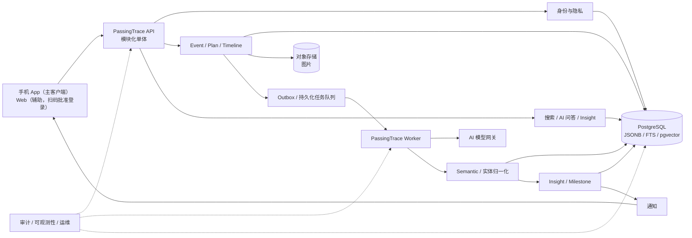

# PassingTrace 核心数据与 AI 分析技术方案

> 版本：v0.1
>
> 定位：产品数据模型、AI 使用原则与 V1 模块功能设计
>
> 修订状态：模块功能扩展稿

**记录是数据入口，AI 是核心价值。**

> 高德定位、地点 Source、按地点 AI 检索与历史地点导航的专项设计见
> `PassingTrace_高德定位与历史地点导航技术方案_v0.1.md`。

本方案暂不实现社交、分享和互动，也不展开到具体类与数据库 DDL，重点确定：

- 用户自由记录如何落库
- AI 如何理解记录
- 如何低成本查询长期数据
- 如何形成长期统计与洞察
- V1 各模块负责哪些功能、如何协作以及怎样验收

---

## 1. 目标与范围

PassingTrace 的产品形态是「手机优先」的个人痕迹系统，类似微信、抖音：**手机 App 是主要客户端**，承载日常的记录、查看、洞察与 AI 问答；**Web 是辅助访问端**，让用户在电脑上也能浏览和操作，但登录依赖已登录的手机扫码批准。

这一形态直接决定了身份链路的设计：

- 手机 App 通过安装引导码完成首次注册，成为该用户的主身份设备。
- 用户想在电脑（Web）上使用时，用手机扫描网页二维码批准登录，Web 获得自己独立的 Token。
- 记录、AI 洞察等核心体验优先在手机端交付；Web 复用同一套业务 API，功能可阶段性对齐，但不作为主入口。

PassingTrace 第一阶段的产品目标不是做“日记 + 社交”，而是做一个能够长期积累个人事件数据，并通过 AI 对过去、现在和未来进行理解与分析的个人痕迹系统。

核心目标：

- 用户可以自由填写已经发生的记录，也可以填写未来计划。
- 记录内容允许自然语言表达，不要求用户预先选择大量分类、标签和结构化字段。
- 系统将用户原始输入作为事实源完整保留，同时异步生成 AI 结构化语义；用户主动删除、注销账户或命中明确的数据保留策略时除外。
- 后续统计、对比和 AI 问答优先基于结构化语义查询，而不是扫描全部原始记录。
- AI 解析结果必须可重算、可版本化，不得替代用户原始数据。

---

## 2. 核心业务概念

| 概念 | 含义 | 当前定位 |
|---|---|---|
| Trace（痕迹） | 已经发生并被用户记录的事件 | V1 核心 |
| Plan（计划） | 未来希望发生、准备执行或待完成的事件 | V1 核心 |
| Semantic（语义） | AI 从原始记录中提取的结构化解释 | V1 核心 |
| Insight（洞察） | 基于大量事件语义产生的统计、趋势和总结 | V1 核心 |
| Milestone（里程碑） | 首次地点、首次美食、新活动、累计次数等值得提示的节点 | V1 可逐步加入 |

Trace 与 Plan 不建议设计成完全不同的数据体系。

两者本质上都是 **Event（事件）**，区别主要体现在：

- 事件类型
- 当前状态
- 实际发生时间
- 计划发生时间

这样计划完成后可以自然转化为历史痕迹。

---

## 3. 总体数据设计原则

核心原则：

> **用户输入可以自由，但系统内部不能自由到无法查询。**

当前技术方向：

- 主数据库采用 **PostgreSQL**。
- 不采用纯 NoSQL 作为核心事件数据库。
- 固定业务字段采用关系型字段。
- 无法提前完全定义的扩展信息采用 `JSONB`。
- 用户原文、用户明确填写的数据与 AI 推测结果分开保存。
- AI 结果作为派生数据存在，可以随时重新生成。
- 统计类问题优先由 SQL / 聚合计算回答。
- AI 主要负责理解、解释、总结和推理，而不是承担数据库扫描。

---

## 4. 三层数据模型

PassingTrace 的核心数据明确拆成三层：

```text
Source
  ↓
Semantic
  ↓
Insight
```

### 4.1 Source：事实源

Source 代表用户真实提供或系统客观采集的数据，是最终可信的数据来源。

包括：

- 用户输入的标题
- 正文
- 备注
- 用户拍摄或选择的图片
- 图片对象存储 Key
- 用户明确填写的金额
- 币种
- 时间
- 地点
- 系统创建时间
- 修改时间
- 设备来源
- GPS 等客观数据（用户授权后）

AI **不能覆盖 Source**。

任何 AI 判断错误，都应该可以重新读取 Source 并重新分析。

---

### 4.2 Semantic：AI 语义层

Semantic 是 AI 对 Source 的结构化理解。

它主要用于：

- 检索
- 统计
- 聚合
- 去重
- 分类
- 上下文选择

可能包含：

- 事件类别
  - 美食
  - 娱乐
  - 出行
  - 工作
  - 运动
  - 消费
  - 其他
- 地点
- 地点类型
- 人物关系
- 事件参与者
- 活动
  - 聚餐
  - KTV
  - 露营
  - 看电影
  - 购物
  - 旅行
- 消费信息
  - 金额
  - 币种
  - 消费类别
  - 是否确定
- 食物 / 餐饮类型
- 标签
- 关键词
- AI 摘要
- 置信度
- AI 模型版本
- 解析时间

---

### 4.3 Insight：洞察层

Insight 不是对单条记录的解释，而是对大量 Event 聚合后的分析结果。

可以按以下周期生成：

- 周
- 月
- 季度
- 年度
- 用户自定义时间范围

可能产生：

- 某类活动发生次数
- 活动趋势变化
- 娱乐消费变化
- 餐饮消费变化
- 出行消费变化
- 新解锁地点
- 新美食
- 新活动
- 与上月相比
- 与上季度相比
- 与去年同期相比
- 计划完成率
- 计划延期率
- 计划取消率
- 外出频率变化
- 活动范围变化
- 生活方式变化

---

## 5. 统一 Event 模型

建议把“过去记录”和“未来规划”统一抽象为 Event。

```text
Event
├─ id
├─ user_id
├─ event_kind
│  ├─ trace
│  └─ plan
├─ status
│  ├─ planned
│  ├─ completed
│  └─ cancelled
├─ title
├─ raw_content
├─ happened_at
├─ planned_at
├─ completed_at
├─ timezone
├─ visibility
├─ source_metadata
├─ archived_at
├─ deleted_at
├─ created_at
└─ updated_at
```

其中：

### `raw_content`

保存用户原始自然语言。

这是整条 Event 最重要的数据之一。AI 不得覆盖它；用户删除、账户注销和数据保留策略由隐私模块统一处理。

### `event_kind`

表示 Event 的创建来源，并且创建后不再改变：

```text
trace
plan
```

- `trace`：用户直接记录已经发生或正在发生的事情。
- `plan`：用户以未来计划的形式创建。
- Plan 完成后仍然保持 `event_kind = plan`，通过 `status = completed` 与 `happened_at` 进入历史时间线。
- 保持来源不变，才能同时回答“做过什么”和“哪些计划真正完成了”。

### `status`

表示事件生命周期：

```text
planned
completed
cancelled
```

- Trace 创建时默认是 `completed`。
- Plan 创建时默认是 `planned`。
- Plan 支持 `planned → completed`、`planned → cancelled`，也支持通过显式“重新打开”从 `completed` 或 `cancelled` 恢复为 `planned`；所有转换必须保留历史。
- 归档不是业务状态，使用 `archived_at` 表示，避免丢失事件原来的完成或取消状态。

### `happened_at`

实际发生时间。Plan 完成时由用户确认或补充；无法精确到时分时，应同时记录时间精度和原始表达。

### `planned_at`

未来计划时间。改期时更新当前值，并由 Plan 模块保留改期历史。

### `completed_at`

用户执行“完成计划”操作的系统时间。它与实际发生时间 `happened_at` 不一定相同。

### `timezone`

记录用户创建或确认事件时使用的时区，所有跨日统计先按用户时区确定自然日边界。

### `visibility`

V1 默认：

```text
private
```

后续再扩展：

```text
private
friends
specified_users
public
```

V1 接口只接受并返回 `private`。预留枚举不代表 V1 已经支持好友、指定用户或公开访问。

### `archived_at` / `deleted_at`

- `archived_at` 只影响默认列表展示，不改变 Event 的业务状态。
- `deleted_at` 表示进入可恢复删除期；保留期结束后，由隐私与数据生命周期任务清除 Source、Semantic、向量和媒体对象。

---

## 6. 结构化语义的存储方式

不建议：

- 所有 AI 结果全部塞进 Event 表
- 所有 AI 结果全部放进无约束 JSON
- 所有字段全部关系型化

推荐：

> **高价值固定结构 + JSONB 扩展**

| 数据类型 | 推荐存储 | 原因 |
|---|---|---|
| 事件主数据 | 关系型字段 | 查询频繁、约束稳定 |
| 消费金额 / 币种 | 结构化表或固定字段 | 需要求和、分组、对比 |
| 地点 | 结构化实体 / 关联 | 需要去重、首次发现、地图统计 |
| 活动 / 美食 / 分类 | 结构化实体或标准化标签 | 需要跨事件统计 |
| AI 低频扩展属性 | JSONB | 无法提前穷举 |
| 向量表示 | pgvector | 用于语义召回 |

---

## 7. AI 解析流程

用户保存 Event 时，不建议同步等待完整 AI 分析。

推荐异步解析：

```text
用户提交 Event
    ↓
Source 立即落库
    ↓
返回保存成功
    ↓
创建 AI 解析任务
    ↓
AI 提取 Semantic
    ↓
保存解析结果
    ↓
保存模型版本 / 置信度
    ↓
必要时刷新聚合统计
    ↓
生成或更新 Insight
```

这样做的好处：

- AI 服务不可用时用户仍然可以正常记录。
- AI 分析失败可以重试。
- 模型升级后可以重新批量分析历史事件。
- 原始用户数据不会受到 AI 解析错误影响。

---

## 8. AI 解析结果不是事实

AI 最大风险之一：

> **把推测当成事实。**

例如用户输入：

```text
今天和朋友去了涩谷吃烤肉，花了 6800 日元，
之后唱了两个小时 KTV。
```

Source：

```text
raw_content = 用户原文
```

AI Semantic 可能解析为：

```text
categories:
  - 美食
  - 娱乐
  - 社交

location:
  - 涩谷

activities:
  - 烤肉
  - KTV

expense:
  amount: 6800
  currency: JPY

people_relation:
  - 朋友
```

但是这里存在一个问题：

`6800 JPY` 到底表示：

- 仅烤肉消费
- 整个活动消费
- 用户个人消费
- 多人总消费

原文并没有完全说明。

因此 AI 应保存：

- 解析值
- 置信度
- 数据来源
- 是否为明确事实
- 是否属于推测

而不是强行把推测写成确定事实。

---

## 9. AI 查询策略：先检索，再阅读

长期使用后，一个用户可能产生：

```text
1,000
5,000
10,000+
```

条事件。

AI 不应该每次读取所有原始记录。

正确流程：

```text
用户问题
    ↓
结构化检索 / SQL 聚合
    ↓
选出少量相关 Event
    ↓
必要时读取这些 Event 的原始内容
    ↓
必要时读取图片语义
    ↓
AI 生成解释 / 总结 / 建议
```

例如用户问：

> 我最近是不是越来越爱出去玩了？

系统首先统计：

- 最近数月娱乐事件数量
- 外出地点数量
- 新地点数量
- 活动类别变化
- 外出频率
- 消费变化

然后只挑选少量有代表性的 Event。

最终再由 AI 解释：

```text
最近三个月你的线下娱乐活动持续增加，
新地点探索数量也明显高于之前。

同时线上娱乐记录下降，
户外和线下活动比例上升。
```

这样 AI 上下文长度取决于：

> **问题相关数据量**

而不是：

> **用户全部历史数据量**

---

## 10. 统计与洞察示例

未来 PassingTrace 可以自动生成：

```text
2026 年 8 月

新地点：4 个
新美食：3 种
娱乐活动：12 次

娱乐消费：¥1,283
较上月：+18%

本月新增活动：
- 卡丁车
- 露营

生活变化：
- 外出频率上升
- 新地点探索增加
- 线上娱乐减少
```

也可以进行长期对比：

```text
2025 → 2026

外出频率        ↑
新地点探索      ↑
餐饮消费        ↑
线下娱乐        ↑
线上娱乐        ↓
户外活动        ↑
```

AI 最终负责将这些统计数据解释成人类能够理解的生活变化。

---

## 11. 新地点 / 新美食 / 新活动

这些不需要分别设计成完全独立的业务模块。

它们本质上属于 Semantic + Insight。

例如：

### 新地点

```text
首次发现：
横滨

首次记录时间：
2026-08-14
```

### 新美食

```text
首次发现：
泰国料理
```

### 新活动

```text
首次发现：
卡丁车
```

系统通过历史 Semantic 数据判断：

> 当前实体是否第一次出现在用户历史记录中。

这样就可以自动生成 Milestone。

---

## 12. 未来计划的数据生命周期

未来规划不应该独立于历史记录。

推荐生命周期：

```text
Plan
  ↓
planned
  ↓
执行
  ↓
completed
  ↓
保持 event_kind = plan
  ↓
补充实际内容
  ├─ 实际时间
  ├─ 图片
  ├─ 消费
  ├─ 地点
  └─ 描述
  ↓
成为历史 Event
  ↓
进入 Semantic
  ↓
进入 Insight
```

这样以后不仅可以分析：

- 做过什么

还可以分析：

- 计划过什么
- 哪些真正完成
- 哪些经常延期
- 哪些经常取消
- 哪些类型计划完成率最高

完成 Plan 时必须保证以下动作在一个可恢复流程中完成：

1. 校验当前状态仍为 `planned`。
2. 写入 `status = completed`、`completed_at` 和用户确认的 `happened_at`。
3. 保存用户补充的 Source 内容与媒体关联。
4. 递增 Source 修订版本。
5. 创建新的 Semantic 解析任务。
6. 触发相关 Insight 与 Milestone 的失效或刷新。

---

## 13. 为什么不优先选择纯 NoSQL

PassingTrace 的“自由”应该存在于：

> **用户输入层**

而不是：

> **数据库完全无结构**

如果核心数据完全采用无固定结构的 NoSQL，短期写入会很简单，但长期 AI 分析会越来越困难。

PassingTrace 未来天然需要：

- 时间范围查询
- 金额求和
- 分组统计
- 去重
- 同比
- 环比
- 地点首次出现判断
- 美食首次出现判断
- 活动首次出现判断
- 标签筛选
- 用户维度隔离
- 多字段组合查询

这些都更适合 PostgreSQL。

PostgreSQL 本身已经可以同时提供：

```text
关系型字段
JSONB
全文检索
pgvector
聚合 SQL
时间范围查询
```

因此当前阶段没有必要为了“自由输入”引入纯 NoSQL。

---

## 14. pgvector 的定位

`pgvector` 后续可以用于：

- 相似事件查找
- 自然语言历史召回
- 用户模糊提问
- 无法通过固定字段准确检索的问题

例如：

> 找一下以前那些让我感觉比较开心的旅行。

这种问题不一定存在明确结构化条件。

可以：

```text
Query Embedding
    ↓
pgvector 召回候选 Event
    ↓
再结合时间 / 分类 / 用户等 SQL 条件过滤
    ↓
少量原文交给 AI
```

但 pgvector **不能替代结构化查询**。

例如：

> 今年吃饭花了多少钱？

应该直接 SQL 聚合，而不是向量检索。

---

## 15. V1 暂缓内容

第一阶段暂不优先实现：

- 点赞
- 评论
- 分享
- 社交推荐
- 公开内容推荐算法
- 复杂好友体系
- 强迫用户手动填写大量标签
- 过度细分的事件分类体系
- 每次查询都让 AI 重读全部历史记录

V1 优先验证两个问题：

1. 用户是否愿意持续记录。
2. AI 能否从长期记录中稳定产生真正有价值的统计和洞察。

---

## 16. 当前技术决策

| 决策项 | 当前结论 |
|---|---|
| 主数据库 | PostgreSQL |
| 自由扩展 | JSONB |
| 语义检索 | 后续使用 pgvector |
| 核心数据抽象 | Event |
| 过去 / 未来区别 | event_kind 记录创建来源，status + 时间字段表达当前生命周期 |
| 原始输入 | Source，AI 不得覆盖；按用户删除与数据保留策略管理 |
| AI 提取 | Semantic，可重算、可版本化 |
| 长期分析 | Insight |
| AI 查询 | 结构化检索 → 少量原文 → AI |
| AI 执行 | 异步解析，失败可重试 |
| 权限 | V1 默认 private，后续扩展 |
| 社交 | V1 暂不实现 |

---

## 17. 当前产品核心

PassingTrace 当前可以概括为：

```text
自由记录
    ↓
长期积累
    ↓
AI 自动理解
    ↓
结构化个人历史
    ↓
统计与比较
    ↓
发现变化
    ↓
辅助未来规划
```

产品真正的核心不是单纯“记录”。

而是：

> **让用户能够通过长期留下的数据重新理解自己的过去，并帮助规划未来。**

---

## 18. 下一步需要继续确定

下一阶段暂时不急着写具体数据库表。

优先确定：

### AI 标准语义协议

也就是一条 Event 经过 AI 后，究竟必须产出哪些标准字段。

需要继续确定：

- Event 必须提取哪些标准语义。
- 哪些字段必须关系型标准化。
- 哪些字段允许 JSONB 扩展。
- 消费如何归一化。
- 地点如何去重。
- 美食如何去重。
- 活动如何去重。
- AI 如何表达不确定性。
- AI 如何记录数据来源。
- AI 结果如何版本化。
- Insight 是实时计算、周期计算，还是两者结合。

这部分确定后，再进入正式数据库表设计。

---

## 19. V1 系统形态与模块边界

### 19.1 总体形态

V1 建议采用：

> **模块化单体 API + 独立异步 Worker + PostgreSQL + 对象存储。**

“模块”首先代表清晰的职责、数据所有权和应用接口，不代表每个模块都必须拆成一个微服务。

V1 不应为了形式上的分布式而过早引入大量服务。建议只保留两个主要运行进程：

1. **PassingTrace API**
   - 对客户端提供 HTTP API。
   - 承担身份校验、参数校验、Event / Plan 写入、时间线查询、搜索、Insight 查询等同步请求。
   - 不同步等待大模型完成语义解析。
2. **PassingTrace Worker**
   - 执行 AI 解析、Embedding、实体归一化、Insight 刷新、Milestone 检测、通知投递、数据清理和批量重算。
   - 通过持久化任务队列消费任务，失败可以重试。

所有业务模块在逻辑上独立，但可以先部署在同一个 API 和同一个 Worker 中。只有当吞吐量、团队边界或安全隔离产生真实需求时，再拆分物理服务。

### 19.2 模块设计原则

- 每次数据访问都必须带上当前 `user_id` 作为隔离条件，不能依赖客户端传入的用户身份。
- Source、Semantic、Insight 分别拥有独立生命周期，禁止 AI 结果反向覆盖 Source。
- 所有可能重复提交的写操作都支持幂等键或版本校验。
- Event 写入与“创建异步任务”必须通过同一事务或 Outbox 保证最终一致。
- 大模型只能返回候选结构化结果，不能直接执行任意 SQL，也不能直接修改业务表。
- AI 输出必须先通过 JSON Schema、枚举、数值范围和用户归属校验，再进入 Semantic。
- 用户能看到 AI 处理状态，并能区分“尚未解析”“解析失败”“已解析”和“结果已过期”。
- 删除、账户注销、用户纠错和模型升级都必须能够触发派生数据失效与重算。
- V1 的模块边界优先保证可测试、可替换和可追踪，不以代码目录数量衡量架构质量。

### 19.3 逻辑架构



### 19.4 V1 基础设施组件

| 组件 | 具体职责 | V1 选择原则 |
|---|---|---|
| PostgreSQL | Event、账户、Semantic、实体、任务、Insight、审计元数据 | 唯一核心数据库 |
| JSONB | 保存低频、可扩展且经过 Schema 管理的语义属性 | 不能成为无约束数据垃圾箱 |
| PostgreSQL 全文检索 | 标题、原文、摘要的关键词召回 | 优先于额外搜索集群 |
| pgvector | 事件与查询向量、相似语义召回 | 只作为候选召回手段 |
| 对象存储 | 原图、缩略图和后续派生媒体 | 数据库只保存对象 Key 与元数据 |
| Outbox / 任务表 | 可靠创建和领取异步任务 | V1 可先采用 PostgreSQL 持久化实现 |
| AI 模型网关 | 模型调用、结构化输出、超时、限流、成本记录 | 业务模块不直接依赖厂商 SDK |
| 调度器 | 定时提醒、周期 Insight、数据清理、重算批次 | 可由 Worker 内部调度起步 |
| Aspire AppHost | 本地开发编排、配置和可观测性入口 | 统一启动 API、Worker 和依赖资源 |

V1 暂不需要 Kafka、Elasticsearch、独立向量数据库、服务网格或按模块拆分数据库。

---

## 20. 模块总览

| 编号 | 模块 | 核心职责 | 主要产出 | V1 优先级 |
|---|---|---|---|---|
| M01 | API 边界 | 认证上下文、校验、幂等、错误和分页协议 | 稳定的客户端接口 | P0 |
| M02 | 账户与身份 | 注册、登录、会话和账户生命周期 | `user_id`、会话、身份主体 | P0 |
| M03 | 用户设置与隐私 | 时区、语言、币种、授权、导出和删除 | 有效用户设置、隐私任务 | P0 |
| M04 | Event 管理 | 创建、修改、删除自由记录和事实源 | Event、Source 修订版本 | P0 |
| M05 | Plan 生命周期 | 创建计划、改期、完成、取消和恢复 | 状态变更、计划历史 | P0 |
| M06 | 时间线与详情 | 统一展示过去记录和未来计划 | 分页时间线、Event 详情 | P0 |
| M07 | 媒体 | 图片上传、关联、派生和清理 | Media 记录、对象 Key | P0 |
| M08 | Semantic 解析 | 将 Source 转为有证据的结构化语义 | SemanticEnvelope | P0 |
| M09 | 实体归一化 | 地点、美食、活动、分类和金额标准化 | 规范实体及 Event 关联 | P1 |
| M10 | 异步任务与重算 | 可靠执行、重试、失效和批量重跑 | 任务状态、执行记录 | P0 |
| M11 | 搜索与召回 | 结构化、全文和向量混合检索 | 相关 Event 候选集 | P1 |
| M12 | AI 问答编排 | 选择查询策略并生成有依据的回答 | 回答、证据、查询范围 | P1 |
| M13 | AI 模型网关 | 隔离模型供应商、提示词和调用策略 | 结构化模型响应、用量记录 | P0 |
| M14 | 统计与 Insight | 产生确定性指标、趋势和 AI 解读 | MetricSnapshot、Insight | P1 |
| M15 | Milestone | 检测首次出现和累计节点 | Milestone 及证据 Event | P1 |
| M16 | 通知 | 计划提醒、洞察和里程碑触达 | 站内通知、投递记录 | P1 |
| M17 | 数据与存储 | 事务、索引、备份、对象生命周期 | 可靠持久化能力 | P0 |
| M18 | 审计、可观测性与运维 | 日志、指标、追踪、告警和受控管理操作 | 审计记录、运维视图 | P0 |

优先级说明：

- **P0**：形成可安全运行的记录与 AI 处理基础闭环。
- **P1**：形成用户可感知的查询、洞察与提醒价值。
- **P2**：不属于当前 V1，只有在核心闭环验证后再评估。

---

## 21. 各模块具体功能

### 21.1 M01：API 边界模块

**职责**

为 Web、移动端和后续客户端提供统一、稳定、安全的应用入口，只处理协议层问题，不承载核心业务判断。

**具体功能**

- 提供 `/api/v1` 版本化接口和 OpenAPI 文档。
- 从访问令牌中解析当前用户身份，并构造可信的 `user_id` 上下文。
- 对请求体、路径参数、时间范围、枚举、文件元数据和分页参数进行校验。
- 为创建 Event、完成 Plan、确认媒体上传等写操作接收 `Idempotency-Key`。
- 为修改和状态流转提供版本号或 ETag，防止并发覆盖。
- 统一输出业务错误码、可读错误消息、字段错误和 `trace_id`。
- 列表查询统一使用游标分页，避免大数据量下偏移分页漂移。
- 按用户、IP、接口类型和 AI 成本设置不同的速率限制。
- 传播 `trace_id` / `correlation_id` 到数据库、任务和模型调用。
- 对耗时 AI 问答支持异步结果或流式返回，但不让普通 Event 保存等待 AI。

**输入与输出**

- 输入：HTTP 请求、访问令牌、幂等键、并发版本、客户端信息。
- 输出：标准响应包装、分页游标、资源版本、错误码和追踪标识。

**关键规则**

- 客户端传入的 `user_id` 只能作为数据，不得用作授权依据。
- API 层不得拼接任意 SQL，也不得把数据库实体直接暴露给客户端。
- 同一个幂等键与不同请求内容同时出现时，必须拒绝而不是静默复用。
- 日志默认不记录访问令牌、完整原文、图片 URL 和模型提示词中的敏感内容。

**V1 边界**

- 只提供第一方客户端 API，不开放第三方开发者平台、Webhook 市场或 GraphQL。

### 21.2 M02：账户与身份模块

**职责**

建立稳定的用户身份、会话和账户生命周期，为所有个人数据提供唯一归属边界。

**具体功能**

- 注册或绑定一个主身份凭据。
- 登录并签发短期访问令牌和可撤销的刷新会话。
- 刷新会话、单设备退出和全部设备退出。
- 获取当前账户的基础信息、创建时间和账户状态。
- 在启用密码登录时支持找回与重置密码。
- 记录登录成功、失败、凭据变更和会话撤销等安全事件。
- 对异常重复登录、暴力尝试和失效令牌进行限制。
- 支持停用账户、申请导出和申请删除账户。

**输入与输出**

- 输入：身份凭据、验证码或外部身份提供方断言、设备和客户端元数据。
- 输出：不可变 `user_id`、访问令牌、刷新会话、账户状态和安全事件。

**关键规则**

- `user_id` 创建后不可重用；账户删除后也不能把旧 ID 分配给新用户。
- 凭据、刷新令牌和验证码只保存安全哈希或由身份提供方托管。
- 所有刷新会话都可单独撤销，并具有绝对过期时间。
- 身份模块只证明“是谁”，Event 可见性仍由授权和隐私规则判断。

**V1 边界**

- V1 只启用一种主登录路径；不实现组织、多租户管理员、好友身份或复杂角色体系。

### 21.3 M03：用户设置与隐私模块

**职责**

管理会影响时间、统计、AI 使用和数据生命周期的用户级设置与授权。

**具体功能**

- 设置语言、时区、周起始日和默认币种。
- 保存日期、金额和距离的展示偏好。
- 管理 GPS、图片 AI 解析、个性化 AI 分析等授权开关。
- 管理计划提醒、Insight、Milestone 等通知偏好和免打扰时段。
- 展示当前数据使用范围、AI 处理状态和有效保留策略。
- 生成用户数据导出任务，并提供有时效的安全下载地址。
- 接收 Event 删除和账户删除请求，驱动级联删除流程。
- 在账户删除等待期内允许用户撤销请求；正式清除后不可恢复。

**输入与输出**

- 输入：用户设置修改、授权同意或撤回、导出请求、删除请求。
- 输出：带版本的有效设置、隐私任务、导出包状态和删除状态。

**关键规则**

- 所有日期分组、提醒和周期 Insight 使用用户时区，而不是服务器时区。
- 授权撤回后立即停止新处理，并安排清理由该授权产生且不再允许保留的派生数据。
- “永久保留 Source”只表示 AI 不得覆盖；不能阻止用户删除自己的数据。
- V1 的 `visibility` 强制为 `private`，即使模型中已经预留其他枚举。
- 用户数据导出地址必须短期有效、一次性或可撤销，并记录下载审计。

**V1 边界**

- 不实现公开主页、好友可见、指定用户共享或细粒度社交权限。

### 21.4 M04：Event 管理模块

**职责**

接收并维护用户对过去、现在和未来事件的事实输入，是所有 Semantic 和 Insight 的上游事实源。

**具体功能**

- 创建 Trace 或 Plan，接受自由文本以及可选标题、时间、地点、金额和媒体。
- 查询单条 Event，返回 Source、业务状态、媒体和 AI 处理状态。
- 修改标题、原文、明确时间、地点、金额等 Source 字段。
- 归档、取消归档、进入删除等待期和在等待期内恢复。
- 按时间、类型、状态、语义类别和关键词筛选 Event。
- 每次用户修改 Source 时递增 `source_revision`，保存修订时间和操作者。
- 将旧 Semantic 标记为 `stale`，创建针对新修订版本的解析任务。
- 返回 `semantic_status`：`not_requested`、`pending`、`running`、`succeeded`、`failed` 或 `stale`。
- 接收用户对 AI 结果的纠错或“解析不正确”反馈，但不直接修改 Source。

**输入与输出**

- 输入：自由文本、显式结构化字段、Event 类型、媒体 ID、幂等键和资源版本。
- 输出：Event、当前 Source 修订版本、状态版本、AI 处理状态和待执行领域事件。

**关键规则**

- 标题、正文、媒体三者至少存在一种有效内容，不能创建完全空白 Event。
- `event_kind` 创建后不可改变；Plan 完成仍保持 `plan`。
- AI 不得修改用户明确填写的金额、时间、地点和正文。
- Semantic 必须引用明确的 `source_revision`，不能把旧结果提升为新修订的当前结果。
- 删除 Event 后，默认查询立即不可见，并使其 Semantic、Insight、Milestone 和向量候选失效。
- 所有写操作使用乐观并发控制，冲突时要求客户端刷新后重试。

**V1 边界**

- 不支持多人共同编辑、模板市场、复杂富文本、周期性 Event 或 Event 之间的任意依赖图。

### 21.5 M05：Plan 生命周期模块

**职责**

管理未来计划从创建到完成、取消和改期的完整状态，并保留计划来源以支持完成率分析。

**具体功能**

- 创建 `event_kind = plan`、`status = planned` 的 Event。
- 修改计划时间、标题、备注、地点和提醒设置。
- 记录每次改期的原计划时间、新计划时间、修改时间和原因。
- 完成计划时补充实际时间、正文、图片、地点和消费。
- 取消计划并可填写取消原因。
- 将已完成或已取消计划显式重新打开为 `planned`，或基于旧计划复制一个新计划。
- 计算即将到期、已过计划时间但未完成等派生状态。
- 为提醒模块提供下次提醒时间和有效计划版本。
- 为 Insight 提供计划总数、完成数、取消数、延期次数和按时完成情况。

**输入与输出**

- 输入：计划字段、完成命令、取消命令、改期命令、状态版本和补充 Source。
- 输出：新的 Plan 状态、计划变更历史、解析任务和 Insight 失效事件。

**关键规则**

- `overdue` 是根据当前时间与 `planned_at` 计算的展示状态，不保存为可漂移的业务状态。
- 只有 `planned` 可以直接完成或取消；重复完成命令必须幂等。
- 完成 Plan 时写入 `completed_at`，并要求确认或明确未知 `happened_at`。
- Plan 完成后进入历史时间线，但 `event_kind` 仍为 `plan`。
- 改期不能覆盖历史，否则无法计算延期与计划稳定性。
- 重新打开 completed Plan 时清除当前 `completed_at`，并由新的 Source revision 明确当前 `happened_at` 是否仍有效；旧值保留在修订和 Transition 历史中，同时使相关 Semantic、Insight 与 Milestone 失效。

**V1 边界**

- 不实现重复计划、子任务、依赖关系、共享计划、日历双向同步和自动替用户完成计划。

### 21.6 M06：时间线与详情模块

**职责**

以统一但可区分的方式展示历史记录、已完成计划、未来计划和取消记录。

**具体功能**

- 提供“全部”“历史”“未来计划”“已取消”视图。
- 按 `happened_at`、`planned_at` 和创建时间生成稳定排序键。
- 使用游标分页，支持日期范围、类别、地点、活动和状态筛选。
- 在列表卡片中展示标题、摘要时间、媒体缩略图、来源类型和 AI 处理状态。
- 在 Event 详情中明确分区展示“用户原始记录”和“AI 理解结果”。
- 展示 Semantic 的模型版本、解析时间、主要置信度和不确定字段。
- 提供修改 Source、完成 Plan、改期、取消、归档、删除和反馈 AI 结果的入口。
- 当 Semantic 尚未完成或已失败时，仍然完整展示 Source。
- 对已删除、无权限或不存在的 Event 返回不可枚举的统一结果。

**输入与输出**

- 输入：视图类型、筛选条件、排序方向和分页游标。
- 输出：Event 摘要列表、下一页游标和完整详情视图模型。

**关键规则**

- 历史视图包含直接创建的 Trace，也包含 `status = completed` 的 Plan。
- 未来视图只包含未删除、未归档且 `status = planned` 的 Plan。
- AI 摘要不能取代原文，原文始终可直接访问。
- 时间线查询不得因为 AI 未完成而遗漏 Event。

**V1 边界**

- 不实现公开动态流、社交推荐流、复杂地图时间线或多人聚合时间线。

### 21.7 M07：媒体模块

**职责**

安全管理 Event 图片从上传、确认、关联、展示到删除的完整生命周期，避免把大文件直接存入关系数据库。

**具体功能**

- 创建上传会话并签发短期、受限制的预签名上传地址。
- 客户端上传后确认对象，校验对象是否存在、大小、MIME、哈希和用户归属。
- 将一个或多个 Media 关联到 Event 的指定 Source 修订版本。
- 生成缩略图、读取图片尺寸、方向和基础元数据。
- 为时间线返回短期下载地址或受控媒体代理地址。
- 移除关联时判断对象是否仍被引用，安排延迟清理孤儿对象。
- Event 或账户删除时级联清理原图和派生对象。
- 记录上传失败、处理失败和清理失败状态，允许后台重试。

**输入与输出**

- 输入：文件名、声明 MIME、字节数、内容哈希、上传确认、目标 Event。
- 输出：`media_id`、对象 Key、上传状态、处理状态、缩略图 Key 和安全访问地址。

**关键规则**

- 对象 Key 必须由服务端生成，并包含不可猜测标识；客户端不得指定任意存储路径。
- 预签名地址只能允许指定用户上传指定类型和大小的单个对象，并具有短过期时间。
- 不能只信任扩展名或客户端 MIME，确认阶段必须检查实际内容类型。
- 未确认上传和未关联对象定期清理，避免长期产生孤儿文件。
- Event 文本保存不能因图片派生处理失败而回滚；媒体状态单独展示和重试。
- 日志不记录长期可访问的原始图片地址。

**V1 边界**

- V1 支持私有图片上传、缩略图和展示，不做视频、音频、OCR、人物识别或图片多模态语义；这些能力必须通过独立授权和版本化管线后再加入。

### 21.8 M08：Semantic 解析模块

**职责**

读取固定 Source 修订快照，将自由文本转换为带版本、证据、不确定性和来源说明的结构化语义。

**具体功能**

- 根据 `event_id + source_revision + pipeline_version` 创建解析运行。
- 检测语言并对过长输入做可追踪的分段或拒绝处理。
- 提取摘要、类别、地点提及、活动提及、美食提及、消费提及、标签和关键词。
- 对每个字段保存原始表达、断言类型、置信度和证据位置。
- 通过 `SemanticEnvelope` JSON Schema 验证模型结构化输出。
- 将有效提及发送到实体归一化模块，不等待归一化也可保留原始 mention。
- 保存不可变 SemanticRun，并在通过发布条件后切换 Event 的 current semantic 指针。
- 接受用户纠正：生成 Source 明确字段或独立 override 修订，再触发新解析。
- 当 Source、Schema、Prompt、模型或词表升级时支持重新解析。

**SemanticEnvelope v1 最小结构**

```text
SemanticEnvelope
├─ event_id
├─ source_revision
├─ run_id
├─ schema_version
├─ pipeline_version
├─ model_provider / model_name / model_version
├─ prompt_version / taxonomy_version
├─ language
├─ summary
├─ categories[]
├─ location_mentions[]
├─ activity_mentions[]
├─ food_mentions[]
├─ expense_mentions[]
├─ tags[] / keywords[]
├─ uncertainties[]
└─ extensions{}
```

每个可推断字段或 mention 至少包含：

```text
raw_surface
value
normalized_value
assertion = explicit | inferred | unknown
confidence = 0.0 .. 1.0
evidence = source_field + start/end 或 structured_field
normalization_status
canonical_entity_id
uncertainty_reason
```

**输入与输出**

- 输入：不可变 Source 快照、用户明确字段、语言与时区、固定版本矩阵。
- 输出：SemanticRun、字段级证据、解析状态、归一化请求和派生数据失效事件。

**关键规则**

- `assertion` 表示原文是否明确表达，`confidence` 表示抽取可靠程度，两者不能合并成一个值。
- “原文明说 6800 JPY”可以是 `explicit`，但消费范围仍可为 `unknown`。
- 同一 Event 可以有多个地点、活动、美食和消费提及，不能强制压缩为单值。
- 模型返回的 JSON 无效时允许一次受限修复；仍不合法则标记失败，不能发布为 current。
- 某些字段失败时可以发布 `partial`，但必须记录缺失字段和不可用于哪些统计。
- 任务完成时如果 Source 已产生新 revision，本次结果标记 `stale`，不得覆盖较新结果。
- 旧 SemanticRun 永不原地修改；current 指针切换和回滚必须可审计。

**状态与版本**

- 运行状态：`pending`、`running`、`valid`、`partial`、`invalid`、`stale`、`superseded`。
- 版本矩阵至少包含：Schema、Pipeline、模型、Prompt、Taxonomy 和 Normalizer 版本。
- 客户端状态将 `valid / partial` 映射为 `succeeded`，将 `invalid` 映射为 `failed`；内部状态不直接暴露为稳定 API 合同。

**V1 边界**

- V1 只解析文本和用户明确结构化字段；人物实体、敏感关系推断、情绪诊断、图片视觉理解和自动健康结论不进入首版协议。

### 21.9 M09：实体与金额归一化模块

**职责**

把 Semantic 中的原始提及连接到可统计的规范实体，同时完整保留用户原始表达和不确定状态。

**具体功能**

- 对类别使用受版本管理的稳定代码表。
- 对地点、活动和美食做 Unicode、大小写、空白、语言与常见别名标准化。
- 依次尝试精确匹配、用户别名匹配、规则候选和受限相似度候选。
- 无法确定时保留 `ambiguous` mention，而不是强制创建错误实体。
- 支持用户确认、拒绝候选、创建个人实体和添加个人别名。
- 支持实体合并和拆分，并触发相关搜索、Insight 与 Milestone 重算。
- 对消费金额使用 Decimal 和 ISO 4217 币种代码。
- 为消费保存用途范围和承担范围，例如 `event / activity / meal / unknown` 与 `personal / group / unknown`。
- 在存在明确汇率来源、日期和版本时才生成换算值；原币种与原金额永远保留。

**输入与输出**

- 输入：Semantic mentions、用户 ID、上下文、明确字段和 Normalizer 版本。
- 输出：CanonicalEntity、EventEntityLink、匹配状态、候选列表和金额规范化结果。

**关键规则**

- 具体地点、美食和活动实体默认按用户空间隔离；类别代码和币种代码可以全局共享。
- 不能只凭 Embedding 自动合并两个实体。
- 归一化失败不使整个 Semantic 失败，原始 mention 仍然可搜索和展示。
- 用户确认优先级高于自动匹配；后续模型重算不得覆盖用户确认。
- 实体合并必须保留旧 ID 映射和审计记录，避免历史引用失效。
- 没有可靠汇率时，不把不同币种直接相加。

**状态与版本**

- 匹配状态：`exact_matched`、`auto_matched`、`provisional`、`ambiguous`、`user_confirmed`、`rejected`。
- 每个结果保存 Normalizer、Taxonomy 和 Alias revision。

**V1 边界**

- V1 只覆盖类别、地点、活动、美食、金额和币种；不做全球 POI 知识库、人物去重或自动构建社交关系图。

### 21.10 M10：异步任务与重算模块

**职责**

可靠执行从 Source 到 Semantic、实体、向量、Insight、Milestone、通知和清理的异步工作，并支持版本升级后的安全重算。

**具体功能**

- 在 Event 写入事务中创建 Outbox 事件，避免记录成功但任务丢失。
- 将 Outbox 转换为可领取任务，并按优先级、计划时间和成本执行。
- 使用租约与心跳领取任务，Worker 崩溃后允许其他实例重新领取。
- 对超时、限流、临时网络错误执行指数退避和随机抖动。
- 对 Schema 不兼容、输入不合法等永久错误进入终止失败或死信状态。
- 提供单 Event 重新解析，以及按用户、Schema、模型、Prompt 或规则版本创建批次重算。
- 批量升级先进行 Canary / 影子运行、质量比较，再切换 current 指针。
- 在任务执行前后检查 Source revision、删除状态和目标版本，阻止过期任务发布。
- 记录尝试次数、耗时、错误分类、模型成本和下游失效范围。
- 支持管理员重试、取消、降级优先级和回滚 current 版本。

**输入与输出**

- 输入：任务类型、资源 ID、Source revision、目标版本、原因、优先级和预算。
- 输出：任务执行记录、派生结果、领域事件、批次报告和失败清单。

**任务幂等键示例**

```text
semantic_parse: event_id + source_revision + pipeline_version
normalize: semantic_run_id + normalizer_version
embedding: event_id + source_revision + embedding_version
insight_refresh: user_id + period + metric_definition_version + input_watermark
milestone_refresh: user_id + entity_type + affected_range + rule_version
```

**状态与失败处理**

- 单任务：`pending`、`leased`、`running`、`retry_wait`、`succeeded`、`failed_terminal`、`cancelled`、`stale`。
- 重算批次：`planned`、`canary`、`running`、`validating`、`activating`、`completed`、`partial_failed`、`failed`、`rolled_back`。
- 达到重试上限后 Event 仍可读写，用户可看到解析失败状态并手动重试。
- 新批次未通过质量门槛时继续使用旧 current 结果，不能半完成地全局覆盖。

**关键规则**

- 模型、Prompt、Schema、Taxonomy 和 Normalizer 版本在入队时固定，不能执行到一半读取“最新配置”。
- 所有派生写入都检查目标对象仍属于同一用户且未删除。
- 批量重算必须有并发、速率、成本和每日预算上限。
- 删除任务优先级高于普通重算，并阻止后续旧任务复活已删除数据。

**V1 边界**

- V1 使用 PostgreSQL Outbox 与持久化任务表即可，但幂等、租约、重试、死信和基本监控不可省略；暂不引入复杂分布式工作流平台。

### 21.11 M11：搜索与召回模块

**职责**

根据用户明确条件或自然语言意图，从个人 Event 中安全、低成本地找到相关记录与确定性指标。

**具体功能**

- 对标题、原文、Semantic 摘要和关键词建立 PostgreSQL 全文检索索引。
- 支持时间、`event_kind`、状态、类别、地点、活动、美食、币种和金额范围过滤。
- 支持按相关度、发生时间、计划时间和更新时间排序。
- 把自然语言条件转换成受控 RetrievalPlan，而不是任意 SQL。
- 对次数、金额、唯一实体数等精确问题调用白名单聚合查询。
- 在启用 pgvector 后，对无法用固定字段表达的问题召回相似 Event 候选。
- 对结构化、全文和向量候选进行合并、去重、打分与裁剪。
- 输出 EvidenceBundle，包括指标、候选 Event、相关片段、数据水位和应用的过滤条件。
- 当向量或 AI 不可用时回退到结构化和全文检索。

**输入与输出**

- 输入：用户 ID、关键词或问题、过滤条件、时区、结果数量和上下文预算。
- 输出：RetrievalPlan、命中 Event、命中原因、EvidenceBundle 和分页游标。

**关键规则**

- 每一层查询都必须强制 `user_id`，不能只在最后一层过滤。
- SQL 聚合优先回答精确计数、金额和完成率；向量相似度不能替代精确计算。
- 不允许模型直接生成并执行任意 SQL，必须使用白名单 Query DSL 和参数化查询。
- `deleted_at` 不为空的 Event、失效 Semantic 和旧向量不能进入候选。
- 低置信或 inferred 字段参与筛选时，结果必须保留不确定性说明。
- “最近”“越来越”等模糊词使用公开的默认时间窗口，并在结果中展示；影响结论较大时要求用户明确范围。

**pgvector 启用条件**

- 积累一组真实用户问题及期望候选 Event 作为评测集。
- 明确 Embedding 模型、维度、数据发送范围和供应商保留策略。
- 达到约定的召回质量，并证明用户隔离、删除和版本失效正确。
- 启用后仍通过 SQL 过滤用户、时间、状态和权限。

**V1 边界**

- V1 首先交付结构化筛选和 PostgreSQL 全文检索；pgvector 保留接口并由功能开关控制，未通过评测前默认关闭。

### 21.12 M12：AI 问答编排模块

**职责**

理解用户针对个人历史的提问，选择合适的数据工具，使用最少且可追溯的证据生成回答。

**具体功能**

- 识别问题类型：查找记录、统计数值、趋势比较、首次出现、计划表现或开放式总结。
- 解析时间范围、类别、地点、活动、币种和计划状态等条件。
- 为受支持意图生成 RetrievalPlan，并调用搜索、指标或混合检索。
- 构造 EvidenceBundle，只包含回答问题所需的聚合结果和少量 Event 片段。
- 生成回答、关键数字、时间范围、假设、不确定性和支持 Event 引用。
- 对长回答支持流式输出；最终保存完整结果与证据快照。
- 在 AI 生成失败时返回已经得到的确定性指标，而不是整次请求失败。
- 对证据不足、数据覆盖不足或问题超出支持范围的情况明确说明。
- 支持对当前问题的有限追问上下文，但不把整段对话永久写入个人事实数据。

**输入与输出**

- 输入：用户问题、时区与语言、可选明确过滤条件、会话上下文和上下文预算。
- 输出：`answer`、`metrics`、`applied_filters`、`supporting_event_ids`、`assumptions`、`data_freshness` 和 `trace_id`。

**关键规则**

- 回答使用“根据你的记录”“在所选时间范围内”等措辞，不把不完整记录推断为完整人生事实。
- 回答中的每个数字必须来自确定性指标或聚合结果，模型不能自行计算或改写。
- Event 原文属于不可信数据，必须作为“证据内容”隔离，不能把其中的指令当成系统提示执行。
- V1 问答只能读取数据，不能自动创建、修改、完成或删除 Event。
- 默认不把完整提示词和原文记录到普通日志；质量分析使用脱敏样本或获得明确授权的数据。
- 数据不足时回答“不足以判断”，不能补造经历、地点、金额或变化原因。

**V1 支持的问题类型**

- 某时间段记录了多少次某类活动。
- 某时间段按币种确认了多少消费。
- 最近几个月某类活动是否增加或减少。
- 第一次记录某地点、美食或活动是什么时候。
- 某时间段计划完成、取消和改期情况。
- 根据关键词、地点或活动查找相关 Event。

**V1 边界**

- 不做通用数据库代理、医疗/心理诊断、财务建议、自动行动代理或跨用户比较。

### 21.13 M13：AI 模型网关模块

**职责**

隔离具体模型供应商和 SDK，为 Semantic 与 AI 问答提供统一、受控、可观测的模型调用能力。

**具体功能**

- 提供结构化抽取、文本生成和后续 Embedding 的统一接口。
- 根据任务类型选择经过批准的模型、Prompt、温度、Token 上限和超时时间。
- 为结构化抽取强制 JSON Schema 或等价的结构化输出约束。
- 对网络错误、限流和暂时性服务错误做有限重试和退避。
- 提供并发限制、用户级配额、全局成本预算和熔断保护。
- 记录供应商、模型、版本、Prompt 版本、输入输出 Token、耗时、结果状态和估算成本。
- 在调用前执行必要的数据最小化与敏感字段处理。
- 支持模型或 Prompt 的灰度版本、Canary 和快速回滚。
- 将供应商错误映射为稳定的内部错误类型，业务模块不依赖厂商错误格式。

**输入与输出**

- 输入：任务类型、经过最小化的数据、Schema、版本矩阵、超时和预算上下文。
- 输出：结构化模型响应、停止原因、用量、供应商请求标识和标准错误。

**关键规则**

- 业务模块不能直接引用供应商 SDK 或在代码中写死模型名称。
- API Key、完整 Prompt、访问令牌和预签名 URL 不进入普通日志。
- 超过 Token 上限时应采用明确的裁剪或分段策略，不能静默截断后假装完整。
- 模型回退只能回退到与目标 Schema 兼容且经过验证的版本。
- 供应商是否保留输入、数据驻留区域和删除机制必须在启用前确认。

**V1 边界**

- V1 可以只接入一个主要供应商和少量固定模型，但必须保留 Adapter 边界、版本记录、超时、限流和成本指标。

### 21.14 M14：统计与 Insight 模块

**职责**

用可复现的确定性规则生成指标和趋势，再由 AI 把这些指标解释为自然语言洞察。

**具体功能**

- 按周、月、季度、年度或自定义范围计算 Event 数量和类别分布。
- 计算地点、活动、美食的唯一数和首次记录数。
- 按原币种汇总用户确认的消费金额。
- 计算计划 cohort 的完成、取消、改期和待完成情况。
- 生成环比、同比或等长区间比较，并标记周期是否完整。
- 选择少量代表 Event 作为变化证据。
- 生成 MetricSnapshot，保存指标定义版本、输入水位、样本数和数据质量。
- 基于 MetricSnapshot 生成 NarrativeInsight，引用具体指标而不是重新计算。
- 支持按需查询和周期快照；Source、Semantic 或规则变化后标记相关周期 `stale`。
- 在计算失败时继续提供旧快照，并展示新鲜度和刷新状态。

**输入与输出**

- 输入：当前有效 Event、Plan 变更历史、可信 Semantic、规范实体、用户时区和指标版本。
- 输出：MetricSnapshot、时间序列、对比值、数据质量说明、NarrativeInsight 和支持 Event。

**统一统计口径**

- 行为统计只包含直接 Trace 和 `status = completed` 的 Plan。
- completed Plan 按 `happened_at` 进入实际活动统计。
- 计划表现以 `planned_at` 落入统计周期的有日期计划作为 cohort。
- 无日期计划不进入按期或逾期指标，但可以进入“待安排计划数”。
- 改期率来自 Plan 变更历史，不能仅根据当前 `planned_at` 推断。
- 明确金额与 AI 推测金额分开；V1 正式合计只使用用户确认或满足质量门槛且明确标注来源的金额。
- 不同币种分别汇总；没有可靠汇率来源和版本时不能直接相加。
- 当前未结束周期与完整上周期比较时，必须使用等长区间或明确标注“截至当前”。
- AI 只能解释 MetricSnapshot 中存在的数字，不能添加新的统计结论。

**Insight 状态**

- `dirty`、`computing`、`ready`、`partial`、`stale`、`failed`。

**V1 边界**

- V1 提供月度概览和自定义时间查询，包括记录次数、类别分布、分币种消费、新实体数、计划完成/取消/改期与上月等长比较；不做因果推断、健康评分或人生预测。

### 21.15 M15：Milestone 模块

**职责**

根据有效历史 Event 和规范实体检测“首次记录”及累计节点，并保留可回算的证据链。

**具体功能**

- 检测首次记录的地点、美食和活动。
- 检测第 N 条记录、第 N 次某活动等受控累计节点。
- 生成 Milestone 列表、详情和时间线徽标。
- 保存触发规则、证据 Event、发生时间、置信度和实体版本。
- 对重复任务和相同规则执行幂等去重。
- 在补录更早 Event、修改时间、实体合并、用户纠正或删除证据时局部重算。
- 支持将旧 Milestone 标记为 `superseded` 或 `retracted`，并指向新的证据。
- 将新 Milestone 发送给通知模块，但通知失败不影响 Milestone 本身。

**输入与输出**

- 输入：已发生 Event、`happened_at`、规范实体、语义质量、累计指标和规则版本。
- 输出：Milestone、证据 Event、状态变化和通知请求。

**关键规则**

- 文案必须使用“首次记录”或“首次在 PassingTrace 中发现”，不能声称这是用户人生中的第一次。
- 只有直接 Trace 和 completed Plan 能参与，planned 或 cancelled 不能触发。
- “首次”按用户时区下的 `happened_at` 判断；相同时间使用稳定 Event ID 作为次序规则。
- `ambiguous` 或低于质量门槛的实体不生成正式 Milestone。
- 唯一性至少包含 `user_id + milestone_type + canonical_entity_id + rule_version`。
- Milestone 是派生结果，不得反向成为地点、活动或美食的事实源。

**状态**

- `candidate`、`active`、`superseded`、`retracted`、`dismissed`。

**V1 边界**

- V1 实现首次地点、首次美食、首次活动和少量累计节点；连续打卡、周年、个人最佳、目标和分享留到后续。

### 21.16 M16：通知模块

**职责**

把计划提醒、Insight、Milestone、导出完成和安全事件转换为可追踪、可去重的用户触达。

**具体功能**

- 创建、分页查询、标记已读、全部已读和删除站内通知。
- 根据 Plan 时间、用户时区和提醒偏好创建提醒任务。
- 在 Insight 可查看、Milestone 产生、数据导出完成时创建通知。
- 为账户验证、凭据恢复等安全流程提供事务邮件 Adapter。
- 保存通知类型、业务引用、计划时间、实际发送时间、渠道、状态和失败原因。
- 对同一业务事件使用稳定 `dedup_key`，避免 Worker 重试产生重复通知。
- 发送失败时独立重试，不影响 Event、Semantic、Insight 或 Milestone。
- 用户关闭某类通知或删除相关资源后，取消尚未发送的任务。

**输入与输出**

- 输入：通知命令、用户偏好、时区、业务引用、渠道和计划发送时间。
- 输出：通知记录、未读数量、投递状态和标准失败原因。

**关键规则**

- 调度时间以 UTC 保存，业务计算和展示使用用户时区。
- 通知内容默认不包含完整 Event 原文、精确位置、完整金额明细或长期媒体地址。
- 已改期、完成、取消、归档或删除的 Plan 不能继续发送旧提醒。
- 站内通知与外部渠道状态分开，外部发送失败不影响站内可见性。
- 用户偏好在创建和实际发送前都要再次检查。

**V1 边界**

- V1 支持站内通知、计划提醒以及必要的账户事务邮件；短信、移动推送、邮件订阅和复杂免打扰规则后续再做。

### 21.17 M17：数据与存储模块

**职责**

为业务数据、派生数据和媒体提供事务、约束、索引、生命周期、备份和恢复能力。

**具体功能**

- 管理 PostgreSQL 连接、事务、迁移、健康检查和慢查询监控。
- 为 Event、Source revision、Semantic、任务、实体、Insight、Milestone、通知和审计保存关系数据。
- 对 JSONB 扩展字段执行应用层 Schema 校验并保存 Schema 版本。
- 建立用户、时间、状态、类别、实体、全文检索和后续向量所需索引。
- 在同一事务中提交业务变更与 Outbox。
- 通过 S3 兼容接口保存私有图片、缩略图和临时导出文件。
- 管理未完成上传、孤立对象、过期导出和已删除资源的清理任务。
- 自动执行数据库备份，在重大迁移前创建可识别备份点。
- 定期在隔离环境进行恢复演练，并校验数据库与对象引用一致性。
- 管理开发、测试、预发布和生产环境的强类型配置与密钥来源。

**输入与输出**

- 输入：事务命令、参数化查询、聚合条件、对象操作、迁移、备份和恢复命令。
- 输出：持久化记录、事务状态、对象 Key、备份产物、恢复报告和健康状态。

**关键规则**

- V1 使用单个 PostgreSQL 实例和数据库，不按用户或模块拆库。
- 所有用户数据查询包含所有权条件；数据库约束与应用层都要防止跨用户关联。
- 时间点使用带时区时间戳保存为 UTC，同时保留用户时区或原始 offset。
- 金额使用精确 Decimal 和 ISO 4217 币种，不使用浮点数。
- JSONB 可扩展但不等于无 Schema；禁止把频繁查询的核心字段藏进任意 JSON。
- 对象存储 Bucket 默认私有，数据库只保存对象 Key，不保存永久公开 URL。
- API、Worker、备份和运维分别使用最小权限凭据。
- 数据库事务与对象存储无法形成同一事务，必须使用媒体状态和补偿清理处理部分失败。
- 密钥不得提交到仓库、写入日志或返回客户端；缺少关键配置时启动失败。
- 恢复旧备份后必须重新应用备份之后的账户删除记录，防止已删除用户数据重新上线。

**备份与恢复最低要求**

- 生产环境自动备份，并记录批次、时间、范围、加密、校验和过期时间。
- 数据库和对象清单使用同一备份批次标识。
- 备份成功不仅看进程退出码，还要验证产物可读取。
- 正式上线前确定 RPO、RTO 和保留周期，并至少完成一次真实恢复演练。
- 用户删除的数据可能在受限备份中保留至备份自然过期，必须在隐私说明中明确。

**V1 边界**

- V1 使用单主 PostgreSQL、关系字段 + JSONB、私有 S3 兼容对象存储和自动备份；不做分库分表、读写分离、跨区域复制或复杂冷热分层。

### 21.18 M18：审计、可观测性与运维模块

**职责**

使 API、Worker、数据库、对象存储和模型调用可定位、可告警、可审计，并提供受限的故障处理能力。

**具体功能**

- 输出结构化日志，并为 HTTP、数据库、对象存储、模型调用和任务生成 OpenTelemetry Trace。
- 通过 `correlation_id` 串联 Event 保存、Outbox、Worker、模型、Semantic 和下游刷新。
- 统计 API 请求量、错误率、延迟、任务积压、重试、死信、AI Token、成本和成功率。
- 提供存活与就绪健康检查，区分进程存活和关键依赖是否可用。
- 对队列持续积压、解析失败率上升、模型限流、数据库异常和备份失败告警。
- 记录登录、凭据变更、会话撤销、隐私授权、数据导出、账户删除和运维操作审计。
- 提供受保护的任务查询、重试、取消、暂停任务类型和批量重算功能。
- 查看当前 Schema、模型、Prompt、Taxonomy 和迁移版本的使用情况。
- 查看备份、恢复演练、删除任务和对象清理进度。
- 对高影响运维操作展示影响范围，并生成不可静默修改的审计记录。

**输入与输出**

- 输入：运行遥测、审计事件、健康结果、运维身份和受控管理命令。
- 输出：Logs、Metrics、Traces、告警、审计记录、运维结果和审计 ID。

**关键规则**

- 普通日志不记录密码、Token、验证码、密钥、完整 Event 原文、完整 Prompt 或预签名 URL。
- Metrics 标签保持低基数，不能把 `user_id` 或 `event_id` 用作指标标签。
- 审计记录只追加；查看和导出审计数据本身也要被审计。
- 运维身份与普通用户身份使用独立授权策略，后台任务使用独立服务身份。
- 运维人员默认不能浏览用户原文或图片；必须查看时需要明确理由、临时授权和完整审计。
- 不提供任意 SQL、任意对象读取或直接编辑 Semantic 作为日常运维功能。
- 健康检查详细信息不得匿名暴露到公网。

**V1 边界**

- V1 使用结构化日志、OpenTelemetry、Aspire Dashboard、基础告警、受保护运维 API 或命令行；不开发完整后台管理网站。

---

## 22. 模块数据所有权与协作事件

### 22.1 数据所有权

| 数据 | 唯一写入模块 | 其他模块如何使用 |
|---|---|---|
| User / Session | M02 账户与身份 | 通过 UserContext 和授权策略读取 |
| UserPreference / Consent | M03 用户设置与隐私 | 读取有效设置快照，不自行修改 |
| Event / SourceRevision | M04 Event | 通过查询接口或领域事件读取 |
| PlanTransition | M05 Plan | Insight 只读计算，通知只读调度 |
| Media | M07 媒体 | Event 只保存合法 media_id 引用 |
| SemanticRun | M08 Semantic | 搜索、Insight 读取 current 或指定版本 |
| CanonicalEntity / EventEntityLink | M09 归一化 | 搜索、Insight、Milestone 只读使用 |
| AsyncTask / RecomputeBatch | M10 异步任务 | 运维模块受控查询和操作 |
| RetrievalPlan / EvidenceBundle | M11 搜索 | M12 AI 问答消费，不反写 Event |
| AI Call Record | M13 模型网关 | 运维读取用量与状态 |
| MetricSnapshot / Insight | M14 Insight | 时间线、问答、通知只读使用 |
| Milestone | M15 Milestone | 时间线、Insight、通知只读使用 |
| Notification | M16 通知 | 客户端查询与标记已读 |
| AuditRecord | M18 审计与运维 | 仅追加，受限查询 |

任何模块都不得绕过数据所有者直接修改其业务表。为了性能建立的只读查询模型必须明确来源、刷新方式和容忍的延迟。

### 22.2 核心领域事件

| 事件 | 生产模块 | 主要消费者 | 必需字段 |
|---|---|---|---|
| `UserPreferenceChanged` | M03 | M14、M16 | user_id、changed_fields、preference_version |
| `AccountDeletionRequested` | M03 | M02、M04、M07、M10、M17 | user_id、request_id、execute_after |
| `EventCreated` | M04 | M10、M06 | user_id、event_id、source_revision、event_version |
| `EventSourceUpdated` | M04 | M10、M11、M14、M15 | user_id、event_id、old/new_revision |
| `EventArchived` | M04 | M06、M11 | user_id、event_id、archived_at |
| `EventDeleted` | M04 | M07、M08、M09、M10、M11、M14、M15 | user_id、event_id、delete_version |
| `PlanRescheduled` | M05 | M14、M16 | event_id、old/new_planned_at、transition_id |
| `PlanCompleted` | M05 | M10、M14、M16 | event_id、source_revision、happened_at、completed_at |
| `PlanCancelled` | M05 | M14、M16 | event_id、cancelled_at、transition_id |
| `MediaReady` | M07 | M04 | user_id、media_id、object_version |
| `SemanticReady` | M08 | M09、M11、M14、M15 | event_id、source_revision、semantic_run_id、version_matrix |
| `SemanticFailed` | M08 | M06、M18 | event_id、source_revision、error_category |
| `EntityLinkChanged` | M09 | M11、M14、M15 | event_id、entity_type、old/new_link、normalizer_version |
| `InsightReady` | M14 | M16 | user_id、period、insight_id、metric_version |
| `MilestoneDetected` | M15 | M06、M16 | user_id、milestone_id、evidence_event_id |
| `MilestoneRetracted` | M15 | M06、M16 | user_id、milestone_id、reason |

**事件统一要求**

- 包含唯一 `event_message_id`、`occurred_at`、`correlation_id` 和 Schema 版本。
- 包含消费者完成幂等处理所需的资源版本或去重键。
- 默认不携带完整 Event 原文、图片 URL、访问令牌或模型 Prompt。
- 事件消费者按至少一次投递设计，重复消费不得产生重复业务结果。
- 事件发布者只声明已经发生的事实，不直接命令所有下游如何实现。

---

## 23. V1 应用接口清单

以下是能力边界，不要求最终路由名称完全一致，但每项能力都应有明确 Command / Query、授权和错误合同。

### 23.1 身份、设置与隐私

| 能力 | 建议接口 | 说明 |
|---|---|---|
| 注册 | `POST /api/v1/auth/register` | 创建账户并返回验证或会话结果 |
| 登录 | `POST /api/v1/auth/login` | 认证并创建刷新会话 |
| 刷新会话 | `POST /api/v1/auth/refresh` | 轮换刷新令牌 |
| 退出 | `POST /api/v1/auth/logout` | 撤销当前会话 |
| 当前用户 | `GET /api/v1/me` | 返回账户和有效偏好摘要 |
| 更新偏好 | `PATCH /api/v1/me/preferences` | 使用版本控制更新时区、币种等 |
| 创建数据导出 | `POST /api/v1/me/exports` | 返回异步任务 ID |
| 查询导出 | `GET /api/v1/me/exports/{id}` | 返回进度和短期下载信息 |
| 申请删除账户 | `POST /api/v1/me/deletion` | 二次确认并创建删除计划 |
| 撤销删除 | `DELETE /api/v1/me/deletion` | 仅在等待期内有效 |

### 23.2 Event、Plan 与媒体

| 能力 | 建议接口 | 说明 |
|---|---|---|
| 创建 Event | `POST /api/v1/events` | Trace / Plan 共用；立即返回 AI 状态 |
| 查询 Event 列表 | `GET /api/v1/events` | 游标分页和结构化筛选 |
| 查询详情 | `GET /api/v1/events/{id}` | 返回 Source、状态、媒体与 Semantic 摘要 |
| 修改 Source | `PATCH /api/v1/events/{id}` | 要求资源版本并生成 Source revision |
| 归档/取消归档 | `POST/DELETE /api/v1/events/{id}/archive` | 不改变业务状态 |
| 删除 Event | `DELETE /api/v1/events/{id}` | 进入删除等待期 |
| 恢复 Event | `POST /api/v1/events/{id}/restore` | 仅在删除保留期内恢复 |
| 完成 Plan | `POST /api/v1/events/{id}/complete` | 写入实际内容和完成时间 |
| 取消 Plan | `POST /api/v1/events/{id}/cancel` | 保存取消 transition |
| 改期 Plan | `POST /api/v1/events/{id}/reschedule` | 保存 old/new 时间 |
| 恢复 Plan | `POST /api/v1/events/{id}/reopen` | 显式恢复为 planned |
| 创建上传会话 | `POST /api/v1/media/uploads` | 返回受限预签名地址 |
| 确认上传 | `POST /api/v1/media/{id}/confirm` | 校验对象并进入 ready |
| 删除媒体 | `DELETE /api/v1/media/{id}` | 校验引用与所有权后异步清理 |

### 23.3 Semantic、搜索、问答与洞察

| 能力 | 建议接口 | 说明 |
|---|---|---|
| 查看 Semantic | `GET /api/v1/events/{id}/semantic` | 返回 current 结果、版本和不确定字段 |
| 请求重解析 | `POST /api/v1/events/{id}/semantic/reparse` | 幂等创建指定版本任务 |
| 提交纠错 | `POST /api/v1/events/{id}/semantic/corrections` | 形成用户确认数据或 override revision |
| 搜索 Event | `GET /api/v1/search/events` | 全文与结构化过滤，游标分页 |
| AI 问答 | `POST /api/v1/ai/questions` | 返回同步、异步或流式回答句柄 |
| 查询问答结果 | `GET /api/v1/ai/questions/{id}` | 返回回答、证据和数据水位 |
| 查询 Insight | `GET /api/v1/insights` | 周期、范围和状态查询 |
| 刷新 Insight | `POST /api/v1/insights/refresh` | 仅创建幂等刷新任务，不同步计算 |
| 查询 Milestone | `GET /api/v1/milestones` | 按类型和时间分页 |
| 查询通知 | `GET /api/v1/notifications` | 返回通知和未读状态 |
| 标记通知已读 | `POST /api/v1/notifications/{id}/read` | 幂等更新当前用户通知 |

### 23.4 通用接口要求

- 创建和状态命令接受 `Idempotency-Key`。
- 修改命令接受 `If-Match`、ETag 或等价资源版本。
- 列表接口返回 `items` 与 `next_cursor`，不暴露数据库 Offset。
- 错误至少区分：参数错误、未认证、无权限、资源不存在、版本冲突、状态转换非法、限流、依赖暂不可用和内部错误。
- Event 是否存在与无权限应使用不会帮助枚举其他用户资源的响应策略。
- 所有响应包含或响应头返回 `trace_id`，便于用户反馈问题时定位。

---

## 24. 关键端到端流程

### 24.1 创建一条 Trace

```text
客户端提交 Trace
    ↓
API 校验身份、幂等键、内容与媒体归属
    ↓
同一数据库事务：
Event + SourceRevision(v1) + Outbox(EventCreated)
    ↓
立即返回 Event 与 semantic_status=pending
    ↓
Worker 领取解析任务
    ↓
固定版本模型生成 SemanticRun
    ↓
Schema 校验 → 实体归一化 → 发布 current Semantic
    ↓
刷新全文索引 / Insight / Milestone
```

**必须保证**

- AI 服务离线时 Source 仍然保存成功并可在时间线看到。
- 相同幂等请求不会创建两条 Event。
- 解析失败不会改变 Source，也不会让 Event 消失。

### 24.2 修改 Source

1. API 校验资源所有权和客户端携带的 Event 版本。
2. 保存新的 SourceRevision，不原地覆盖旧修订的语义依据。
3. 更新 Event current source 指针并递增版本。
4. 将旧 Semantic、搜索向量和相关 Insight 标记为 `stale`。
5. 创建针对新 Source revision 和固定 Pipeline version 的解析任务。
6. 旧任务晚到时只能保存为 stale run，不能切换 current 指针。

### 24.3 完成一项 Plan

1. 校验 Event 属于当前用户、`event_kind = plan` 且状态仍为 `planned`。
2. 保存 PlanTransition：`planned → completed`。
3. 写入 `completed_at`，并让用户确认或补充 `happened_at`。
4. 保存新增正文、地点、金额和媒体对应的新 SourceRevision。
5. 保持 `event_kind = plan`，在历史时间线中按实际发生 Event 展示。
6. 创建 Semantic 解析任务，取消尚未发送的旧计划提醒。
7. 刷新活动统计、计划 cohort 指标和可能的 Milestone。

### 24.4 回答一个个人数据问题

```text
用户问题
    ↓
问题类型与时间范围解析
    ↓
生成白名单 RetrievalPlan
    ↓
SQL 指标 / 结构化过滤 / 全文检索
    ↓
必要时使用 pgvector 召回候选
    ↓
构造最小 EvidenceBundle
    ↓
AI 解释指标与少量证据
    ↓
返回回答 + 时间范围 + 假设 + 支持 Event
```

**必须保证**

- 精确数字来自确定性查询，不由模型估算。
- 任一查询层都不能越过当前 `user_id`。
- 向量、AI 或 Narrative 失败时，已有确定性指标仍可返回。
- 证据不足时明确说明，不生成虚构结论。

### 24.5 删除 Event 或账户

1. 用户发起删除，隐私模块记录请求与执行时间。
2. Event 立即从普通查询中隐藏，并阻止新的解析、提醒和洞察使用。
3. 取消相关待执行任务；正在执行的任务发布前检查删除版本。
4. 清除或失效 Semantic、实体链接、向量、Insight、Milestone 和通知引用。
5. 媒体模块确认无其他引用后删除对象及缩略图。
6. 账户删除覆盖会话、账户数据、全部 Event 和导出文件。
7. 受限备份中的副本按公开的备份保留期自然过期。

### 24.6 模型或规则升级

1. 创建 RecomputeBatch，固定新版本矩阵和目标范围。
2. 选择少量 Canary 数据影子解析，不改变 current 指针。
3. 比较 Schema 合法率、字段覆盖率、关键字段差异、成本与延迟。
4. 达到质量门槛后批量生成新 run；失败项保留旧 current。
5. 分批切换 current 指针，并标记受影响 Insight / Milestone stale。
6. 发生质量问题时回滚 current 指针，不删除旧 run。

---

## 25. 与当前 .NET 项目的代码映射

当前项目已从单一 Auth 模板演进为按业务域组织的模块化单体：Identity（身份域）与 Events（记录域）各自独立，Core 与 Infrastructure 作为跨域共用层。目标实现既不把全部业务塞进一个项目，也不把每个逻辑模块拆成微服务。

当前与规划中的目录结构：

```text
PassingTrace.slnx
├─ AppHost
│  └─ 本地编排 PostgreSQL、Identity、Events API、Vue 与遥测
├─ Identity
│  ├─ PassingTrace.Identity.Domain
│  ├─ PassingTrace.Identity.Application
│  ├─ PassingTrace.Identity.Infrastructure
│  └─ PassingTrace.Identity.AuthorizationServer   # 授权服务器（OpenIddict + Identity）
├─ Events
│  └─ PassingTrace.Events.Api                     # 记录域 API（Event / Plan / Timeline / Media）
├─ PassingTrace.Core                              # 跨域共用：领域模型 + 端口接口
├─ PassingTrace.Infrastructure                    # 跨域共用：单库持久化 + Outbox + 对象存储 + AI Adapter
├─ PassingTrace.Contracts                         # 跨域共用：API 合同 + SemanticEnvelope + 领域事件 Schema
├─ Ai（规划）
│  ├─ PassingTrace.Ai.Api                         # AI 问答 / 搜索 / Insight 查询
│  └─ PassingTrace.Ai.Worker                      # SemanticParse / Normalize / Insight / Milestone 处理
├─ tests
│  └─ PassingTrace.Identity.IntegrationTests
├─ passingtrace-web
├─ passingtrace-mobile
└─ passingtrace-sso-demo
```

### 25.1 代码组织规则

- 各域 Api 不直接操作 DbContext 执行业务逻辑，而是调用 Core 的端口接口与用例。
- `Worker` 与 API 复用 Core 中的业务规则，但使用独立服务身份和任务上下文。
- Core 不依赖 ASP.NET Core、数据库、对象存储或具体 AI SDK。
- Infrastructure 实现端口，不把供应商类型泄露到领域模型。
- Contracts 只放稳定的跨边界合同，不放数据库实体。
- 模块之间通过应用接口和领域事件协作，不共享可任意修改的 Repository。
- 每个关键状态机、统计口径和 Semantic Schema 都必须有单元或契约测试。

### 25.2 当前状态与后续建议

已完成：

- `Identity` 域独立：注册、登录、扫码登录、授权码 + PKCE、Refresh Token 与移动授权（M02）。
- `Events` 域建立 `PassingTrace.Events.Api`：Event 创建、游标分页、Source 修订与软删除（M04 核心闭环）。
- `PassingTrace.Core` 提供 Event / SourceRevision 领域模型与 `IEventRepository` 端口；`PassingTrace.Infrastructure` 提供 `TraceDbContext` 与仓储实现（M17）。
- `Events.Api` 通过 JwtBearer + `passingtrace-api` audience 离线验证 Identity 签发的 Token，不引用 Identity 程序集。
- AppHost 已编排 PostgreSQL（identity / trace 两库）、Identity、Events API 与 Vue。

后续建议：

- 补 Events 域集成测试（对应验收场景 1/2/3/9）。
- 建立 Outbox 与 `Ai.Worker` 骨架，为异步 Semantic 解析预留可靠任务通道（M10）。
- 实现 Plan 生命周期状态机（M05）与时间线（M06）。
- 对象存储可先使用 S3 兼容开发资源（M07）。
- 暂不实现开放式 AI 问答（M12）。

---

## 26. V1 实施顺序

### 阶段 0：冻结合同

- 确定 Event / Plan 状态机和时间字段语义。
- 发布 `SemanticEnvelope v1` JSON Schema。
- 发布核心领域事件 Schema 和统一错误码。
- 确定隐私删除、备份保留、AI 供应商数据处理和用户授权规则。

**完成条件**：同一份示例 Event 能稳定得到可验证的 Source、Semantic 和状态转换结果。

### 阶段 1：可靠记录闭环

- M01 API 边界。
- M02 账户与身份。
- M03 用户设置与隐私基础。
- M04 Event。
- M05 Plan。
- M06 时间线基础。
- M07 私有图片基础。
- M10 Outbox / Worker。
- M17 PostgreSQL 与对象存储。
- M18 日志、Trace、健康检查和基础审计。

**完成条件**：AI 完全不可用时，用户仍能安全地创建、修改、完成、查询和删除私有 Event。

### 阶段 2：AI 语义闭环

- M08 Semantic。
- M09 实体与金额归一化。
- M13 AI 模型网关。
- 解析状态、失败重试、用户纠错和单 Event 重算。

**完成条件**：Source 修改后旧任务不会覆盖新结果；每个 AI 字段均可追溯到 Source 证据和版本矩阵。

### 阶段 3：核心用户价值

- M11 结构化与全文搜索。
- M12 受控 AI 问答。
- M14 月度 Insight。
- M15 首次记录 Milestone。
- M16 站内通知和计划提醒。

**完成条件**：用户能从长期记录中找到事件、得到有证据的统计回答，并看到可重算的月度变化与首次记录。

### 阶段 4：上线加固

- 批量重算 Canary 与回滚。
- 数据导出和账户删除全链路。
- 自动备份与真实恢复演练。
- 速率、成本、容量和告警阈值。
- 安全、隔离、隐私和故障恢复测试。

**完成条件**：关键失败场景有明确降级路径，数据可以恢复，用户删除可以完成并被审计。

---

## 27. V1 验收场景

以下场景全部通过，才表示模块已经形成完整闭环：

1. **AI 离线保存**：模型供应商不可用时，Trace 仍保存并立即出现在时间线，状态显示解析失败或等待重试。
2. **幂等创建**：客户端因网络问题重复提交同一个幂等键，只产生一条 Event。
3. **并发修改**：两个客户端同时修改 Event，旧版本请求得到冲突，不覆盖新内容。
4. **旧任务隔离**：Source v2 已保存后，晚到的 v1 Semantic 不会成为 current。
5. **Plan 完成**：完成 Plan 后保持同一 Event ID 和 `event_kind = plan`，进入历史时间线并保留 Transition。
6. **Plan 改期统计**：多次改期后仍能计算改期次数，当前计划时间不会抹掉历史。
7. **事实与推测分离**：6800 JPY 原文存在但承担范围未知时，Semantic 标记 explicit + unknown scope，不显示为确定个人餐费。
8. **跨币种安全**：JPY 与 CNY 没有可靠汇率时分别展示，不产生伪精确总额。
9. **租户隔离**：用户 A 即使猜到用户 B 的 Event、Media 或 Insight ID，也无法判断或读取其内容。
10. **删除级联**：删除 Event 后普通查询、全文、向量、Insight、Milestone 和旧任务都不能使它重新出现。
11. **确定性回答**：次数、金额和完成率来自可复现查询，回答返回时间范围和证据 Event。
12. **数据不足**：记录覆盖不足时，AI 明确说明限制，不推断完整生活状态或因果关系。
13. **重算回滚**：新模型 Canary 未达质量门槛时不切换 current；切换后也可回滚旧版本。
14. **通知去重**：任务重试不会重复发送同一计划提醒或 Milestone 通知。
15. **隐私导出与删除**：用户能查看导出/删除进度，短期下载过期，正式删除后在线数据不可访问。
16. **可恢复性**：可以从备份在隔离环境恢复，并验证 Event、媒体引用和迁移版本一致。
17. **敏感日志检查**：普通日志和 Trace 中不存在密码、Token、完整原文、Prompt 或预签名 URL。
18. **故障可定位**：使用一个 trace_id 能串联 API 请求、Outbox、Worker、模型调用和 Semantic 写入。

---

## 28. 实施前仍需产品或技术负责人拍板的事项

这些问题不影响当前模块边界，但会改变具体合同和验收口径：

1. V1 的唯一主登录方式，以及是否要求邮箱验证。
2. Event 软删除等待期、账户删除等待期和备份保留周期。
3. Source 历史修订的保留策略，以及用户是否能查看修订记录。
4. 无法精确到时分的发生时间如何表达：仅日期、时间范围或精度枚举。
5. `SemanticEnvelope v1` 的必选类别和受控 Taxonomy 初始集合。
6. 哪些 Semantic 字段允许用户直接纠正，纠正进入 Source 还是独立 Override。
7. AI 供应商、数据驻留、输入保留、内容训练和删除保证。
8. 消费正式统计是否只接受用户明确金额，还是允许达到阈值的 AI 提取金额。
9. 是否在 V1 提供汇率换算；若提供，汇率来源、日期和历史版本是什么。
10. 月度 Insight 的生成日、当前周期比较方式和旧快照保留时间。
11. pgvector 的离线评测集、召回指标、成本门槛和正式启用条件。
12. 生产环境 SLO、AI 成本预算、RPO、RTO 和告警责任人。

以上事项确定后，数据库表、索引、API DTO 和测试用例应直接从本模块合同派生，避免各层分别重新解释业务规则。

---

## 29. 已确定：生活分类、行为标签与地点检索

- `SemanticEnvelope v2` 输出一个受控主分类和最多 5 个受控行为标签，均要求置信度及正文位置或 `mediaId` 证据。
- 主分类词表版本 `life-v1`：美食、购物、旅行、美景、娱乐、运动、工作、学习、社交、居家、健康、交通、其他。
- 用户决定写入 `SourceRevisionLabel`；当前合并结果写入 `EventLabelIndex`。人工主分类优先，AI 行为标签阈值为 0.70，人工排除项不会在同一 Source 上恢复。
- 用户可以新增 1–24 字符的自定义行为标签；AI 不生成自由标签。一条记录最多 10 个生效行为标签。
- Event 保存时立即建立包含原文、人工标签和确认地点的基础搜索索引；Worker 后续添加 AI 摘要、图片描述、AI 标签和 embedding，因此模型故障不会阻塞人工内容检索。
- 用户确认地点作为 SourceRevision 事实写入 `EventLocation`；AI 地点提及只能检索，不能生成坐标或导航。历史地点聚合到可重建的 `UserPlace`。
- 故事线不在当前范围内，但标签和地点均保留修订、时间、来源及证据，未来可以按时间序列安全构建。
