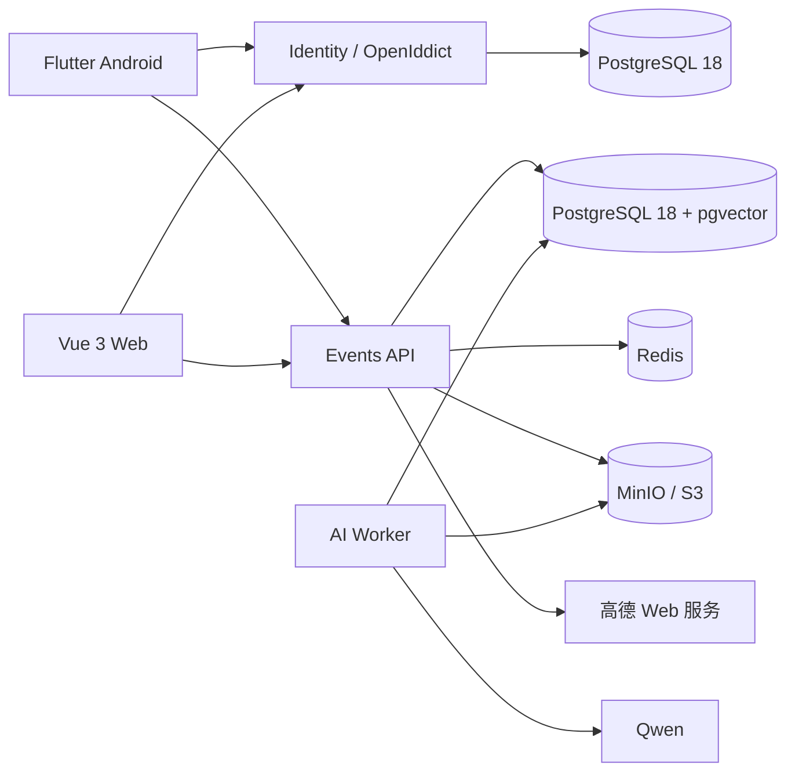

# PassingTrace

> 记录生活留下的痕迹，并让 AI 在属于你的数据中寻找答案。

PassingTrace 是一个面向个人的身份与活动记录平台。它以 Android App 为主要入口，支持记录文本、图片、视频、文件、分类标签与地点；电脑端可以通过手机扫码批准登录，并使用 Web 客户端查看记录、与个人 AI 助手对话。

项目采用 .NET Aspire 编排完整的本地开发环境，后端基于 .NET 10、PostgreSQL 18、pgvector、Redis 与兼容 S3 协议的对象存储，客户端由 Flutter Android 和 Vue 3 构成。

> [!WARNING]
> 项目仍处于积极开发阶段，数据库结构和公共接口可能发生变化。目前更适合本地体验、学习和共同开发，不建议未经安全评估直接部署到公网。

## 功能概览

- **个人记录**：创建“痕迹”或“计划”，保存标题、正文、时间、附件和地点。
- **多媒体附件**：上传图片、视频以及常见文档和其他文件，文件保存在私有 S3 对象存储中。
- **分类与标签**：支持人工分类和标签；未填写时由 AI 从正文和图片中补充结构化分类。
- **地点能力**：Android 端使用高德定位获取一次前台位置，支持附近地点、关键词搜索以及历史地点导航。
- **个人 AI 助手**：结合全文、向量、分类、标签、地点和结构化统计回答关于个人记录的问题，并返回记录证据。
- **用户记忆**：按用户隔离长期记忆及其来源，减少重复分析，同时允许纠正和遗忘。
- **身份与扫码授权**：基于 OpenID Connect、Authorization Code + PKCE；手机可扫描电脑端二维码并批准登录。
- **可观测性**：通过 Aspire Dashboard 查看服务状态、日志和分布式追踪。

## 界面分工

| 客户端 | 定位 | 主要用途 |
| --- | --- | --- |
| Android App | `passingtrace-mobile/` | 注册与登录、记录生活、上传附件、定位地点、AI 问答、扫码批准电脑登录 |
| Web | `passingtrace-web/` | 电脑端记录管理、AI 问答、分类与地点编辑、发起扫码登录 |

## 技术架构



核心技术：

- .NET 10、ASP.NET Core、Entity Framework Core、Npgsql
- .NET Aspire 13.5
- OpenIddict 7.6、JWT Bearer、PKCE
- PostgreSQL 18、pgvector、Redis
- MinIO / S3
- Microsoft Agent Framework、Microsoft.Extensions.AI、Qwen
- Flutter（Android）、Vue 3、TypeScript、Vite
- 高德 Android 定位 SDK 与高德 Web 服务

## 项目结构

```text
AppHost/                         Aspire 本地编排入口
Ai/PassingTrace.Ai.Worker/       多媒体语义分析、Embedding 与记忆归纳
Events/PassingTrace.Events.Api/  记录、媒体、地点与 AI 问答 API
Identity/                        Identity 领域、应用、基础设施和授权服务器
PassingTrace.Core/               领域模型与共享抽象
PassingTrace.Infrastructure/     EF Core、PostgreSQL 与数据访问
passingtrace-mobile/             Flutter Android 主客户端
passingtrace-web/                Vue 3 第一方 Web 客户端
tests/                           后端集成测试
deploy/                          部署相关文件
```

更详细的设计资料位于仓库根目录的 Markdown 文档中：

- [多媒体与 AI 记忆运行说明](PassingTrace_%E5%A4%9A%E5%AA%92%E4%BD%93%E4%B8%8EAI%E8%AE%B0%E5%BF%86%E8%BF%90%E8%A1%8C%E8%AF%B4%E6%98%8E_v1.0.md)
- [核心数据与 AI 分析技术方案](PassingTrace_%E6%A0%B8%E5%BF%83%E6%95%B0%E6%8D%AE%E4%B8%8EAI%E5%88%86%E6%9E%90%E6%8A%80%E6%9C%AF%E6%96%B9%E6%A1%88_v0.1.md)
- [高德定位与历史地点导航技术方案](PassingTrace_%E9%AB%98%E5%BE%B7%E5%AE%9A%E4%BD%8D%E4%B8%8E%E5%8E%86%E5%8F%B2%E5%9C%B0%E7%82%B9%E5%AF%BC%E8%88%AA%E6%8A%80%E6%9C%AF%E6%96%B9%E6%A1%88_v0.1.md)

## 本地开发

### 环境要求

- Windows 10/11（当前主要开发与验证环境）
- [.NET 10 SDK](https://dotnet.microsoft.com/download/dotnet/10.0)
- [Docker Desktop](https://www.docker.com/products/docker-desktop/)
- Node.js `22.18+` 或 `24.12+`，并启用 Corepack
- Flutter SDK（包含 Dart `3.13+`）
- Android Studio、Android SDK Platform-Tools；真机调试还需要开启 USB 调试

Kubernetes 和 Helm 不是本地启动 PassingTrace 的必要条件。只需 Docker Desktop 和 Aspire，便可运行 PostgreSQL、Redis、MinIO 及全部应用服务。

### 1. 克隆与还原依赖

```powershell
git clone git@github.com:wogenbenmeizaiyi/passing-trace.git
cd passing-trace

dotnet restore PassingTrace.slnx

cd passingtrace-web
corepack pnpm install
cd ..\passingtrace-mobile
flutter pub get
cd ..
```

使用 HTTPS 克隆时，可将第一条命令替换为：

```powershell
git clone https://github.com/wogenbenmeizaiyi/passing-trace.git
```

### 2. 配置本地密钥

AppHost 使用 .NET User Secrets，真实密钥不会写入仓库。以下值均为本地示例，请替换成自己的安全值：

```powershell
dotnet user-secrets set --project AppHost "Parameters:postgres-password" "change-this-postgres-password"
dotnet user-secrets set --project AppHost "Parameters:minio-access-key" "passingtrace-local"
dotnet user-secrets set --project AppHost "Parameters:minio-secret-key" "change-this-minio-secret"
dotnet user-secrets set --project AppHost "Parameters:qwen-api-key" "your-qwen-api-key"
dotnet user-secrets set --project AppHost "Parameters:amap-web-service-key" "your-amap-web-service-key"
```

如需让真机直接访问 MinIO 预签名地址，还应把对象存储公开地址设置为电脑的局域网地址：

```powershell
dotnet user-secrets set --project AppHost "Parameters:object-storage-public-endpoint" "http://192.168.x.x:9000"
```

Android 高德 Key 写入不会提交的 `passingtrace-mobile/android/local.properties`：

```properties
AMAP_ANDROID_KEY=your-amap-android-key
```

高德 Android Key 需要与 `com.passingtrace.passingtrace_mobile` 的包名和本机调试签名 SHA-1 匹配；后端使用的高德 Key 应选择“Web 服务”平台。没有有效的 Qwen 或高德 Key 时，对应的 AI、地点能力将不可用，但不应把真实 Key 写进源码或 `appsettings.json`。

### 3. 启动完整环境

在仓库根目录运行：

```powershell
dotnet run --project AppHost/AppHost.csproj
```

终端会输出 Aspire Dashboard 的地址和一次性登录链接。Dashboard 是本地端口、服务状态、日志和 Trace 的可靠入口。

默认开发地址：

- Web：<http://localhost:5173>
- Identity HTTP：<http://localhost:56229>
- Events API HTTP：<http://localhost:54934>

首次本地注册使用的 Development 安装引导码为 `passingtrace-local-setup`。它只用于本地开发，生产环境必须移除或替换。

## Android 调试

### 模拟器

Android Emulator 使用 `10.0.2.2` 访问宿主 Windows：

```powershell
cd passingtrace-mobile
flutter run `
  --dart-define=PASSINGTRACE_IDENTITY_URL=http://10.0.2.2:56229 `
  --dart-define=PASSINGTRACE_EVENTS_API_URL=http://10.0.2.2:54934
```

### USB 真机

确认设备已授权后，将本机端口反向映射到手机：

```powershell
$adb = "$env:LOCALAPPDATA\Android\Sdk\platform-tools\adb.exe"
& $adb devices
& $adb reverse tcp:56229 tcp:56229
& $adb reverse tcp:54934 tcp:54934
& $adb reverse tcp:9000 tcp:9000

cd passingtrace-mobile
flutter run
```

也可以让手机和电脑连接同一局域网，并通过 `--dart-define` 传入电脑的局域网 IP。此时需确保 Windows 防火墙允许相应端口，并将对象存储公开地址配置成手机可以访问的地址。

构建可侧载的 Debug APK：

```powershell
cd passingtrace-mobile
flutter build apk --debug
```

输出文件位于 `passingtrace-mobile/build/app/outputs/flutter-apk/app-debug.apk`。

## 数据与隐私边界

- PostgreSQL 与 MinIO 使用持久卷，本地停止 AppHost 不会自动删除已有数据。
- 附件存放在私有对象存储中，客户端通过短期预签名地址上传或访问。
- 精确坐标由用户主动触发并确认；Android 不进行后台定位，也不保存轨迹。
- AI 分析结果与用户原始记录分层保存，AI 不覆盖原始事实。
- 搜索、记忆、对话和 Agent 工具都按当前登录用户隔离。
- Token 和设备凭据在 Android 端使用安全存储；Web Token 保存在当前标签页的 `sessionStorage`。
- 日志和 Trace 不应记录正文、图片、Token、密钥、精确坐标或预签名 URL。

## 构建与测试

后端：

```powershell
dotnet build PassingTrace.slnx
dotnet test
dotnet format --verify-no-changes
```

Web：

```powershell
cd passingtrace-web
corepack pnpm test:unit
corepack pnpm lint
corepack pnpm build
```

Android：

```powershell
cd passingtrace-mobile
flutter analyze
flutter test
flutter build apk --debug
```

部分后端集成测试会通过 Testcontainers 启动 PostgreSQL 18、pgvector 和 MinIO，因此运行测试时需要 Docker Desktop。

## 贡献

欢迎提交 Issue、设计讨论和 Pull Request。

1. 从 `main` 创建以 `codex/` 或功能名称命名的分支。
2. 新行为应在对应的后端、Web 或 Flutter 测试目录中增加覆盖。
3. 提交前运行受影响范围的测试、静态检查和构建。
4. Commit 信息遵循 Conventional Commits，例如 `feat:`、`fix:`、`docs:`、`test:`。
5. 不要提交 API Key、Token、证书、User Secrets、`.env.local` 或 Android `local.properties`。

## 路线方向

- 完善媒体处理、AI 分析和历史数据补算体验
- 增强基于分类、标签、时间与地点的个人检索和统计
- 完善长期记忆的确认、纠正与遗忘机制
- 在现有修订、时间、标签和地点证据上构建个人故事线
- 补充生产部署、安全加固和持续集成

## 许可证

仓库目前尚未包含开源许可证。在许可证文件补充之前，代码的复制、修改和再分发权利并未被明确授予。如果你是项目维护者，请在正式公开推广前选择并添加合适的许可证（例如 MIT、Apache-2.0 或其他符合项目目标的许可证）。
